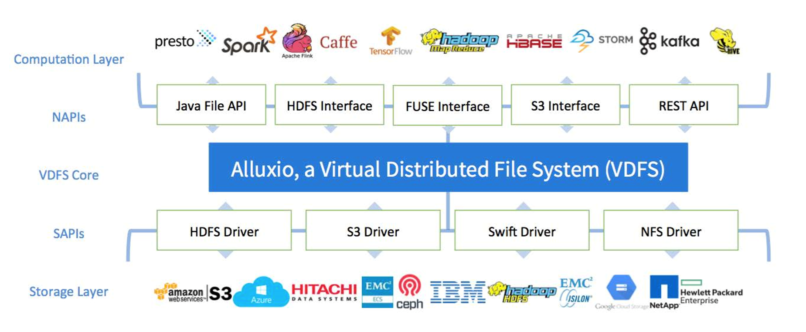
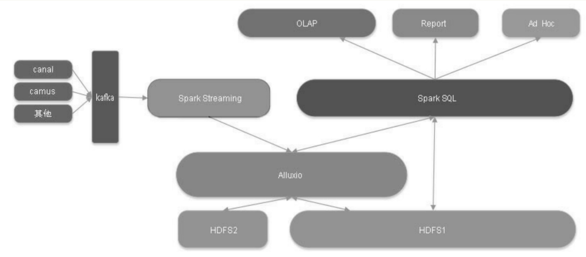
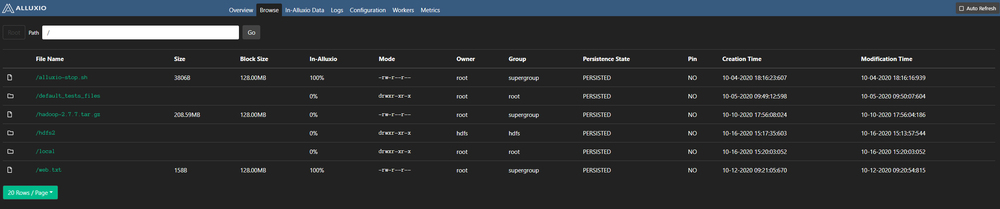

# 1.背景概述
&emsp;&emsp;当今世界正迈入一个新数据革命的时代。随着互联网、人工智能、移动设备、自动驾驶和物联网（IoT）的快速发展，在人类社会的生产、生活中，人、资金、商品、信息的流动都可以以数据化的方式呈现。这场数据革命正在深刻地改变着每个行业的运作方式，而有效地管理这些数据、挖掘数据的深度价值，对国家治理、社会管理、企业决策和个人生活将带来巨大的作用和影响。数据已经成为现实中很多公司业务中至关重要的一环。新数据革命的时代，我们在产生、收集、存储、管理和分析方面的数据总量呈指数级的增长。大规模数据资源给人们带来新的发展机遇的同时，也带来很多新的技术挑战。格式多样、形态复杂、规模庞大的行业大数据给传统的计算技术带来了很多技术困难。

&emsp;&emsp;在数据计算层，生态系统从 MapReduce框架开始，发展到上百个不同的通用和专用的计算系统，如Apache Spark、Apache Hadoop MapReduce、Apache HBase、Apache Hive、Apache Flink、Presto等。在存储层，用户可以选择HDFS，也可以选择对象存储、BLOB存储、键-值对存储系统、NoSQL数据库等，如Amazon S3、OpenStack Swift、GlusterFS、HDFS、MaprFS、Ceph、NFS、OSS等。计算和存储层面的创新为用户提供了丰富选项的同时，也迎来了以下重大挑战：

* **数据共享和管理**

    &emsp;&emsp;许多组织，尤其是大型企业，会同时使用多种存储系统和多种计算引擎。例如，它们会同时使用Amazon S3、GCS、HDFS及EMC ECS等系统。为了让计算框架和应用程序能高效地在各种存储系统中共享和管理孤立的数据（很多也是重复的），需要进行很多额外的工作和管理。

* **性能**

    &emsp;&emsp;大多数存储系统都是为通用的工作负载而设计的，并且和计算系统分离部署。在这些情况下，网络和硬盘的带宽经常成为性能瓶颈。提供高 I/O 性能的计算应用程序十分具有挑战性。

* **灵活性**

    &emsp;&emsp;随着生态系统的快速发展，在一个现有架构中部署和应用新技术会带来许多额外工作。例如，使用新的存储系统可能会导致重新编译甚至重新开发现有应用程序。

<div align="center"></div>
  
&emsp;&emsp;Alluxio 在此背景下应运而生。它是第一个以内存为中心的分布式虚拟存储系统。如下图所示，Alluxio统一了数据访问的方式，在上层计算框架和底层存储系统之间架起了通道。应用只需要连接 Alluxio 即可访问存储在底层任意存储系统中的数据。在大数据生态系统中，Alluxio 介于计算框架和持久化存储系统之间，为这些新型大数据应用于传统存储系统建立了桥梁。Alluxio为大数据软件栈带来了显著的性能提升，其以内存为中心的架构能够使现有方案的数据访问速度提升两个数量级.

# 2.Alluxio优势
&emsp;&emsp;Alluxio在大数据系统栈里位于计算框架和应用程序（如Apache Spark、Hadoop MapReduce）之下，持久化存储系统（如Amazon S3、Hadoop HDFS、OpenStack、Swift）之上，提供一个以内存存储为中心的数据访问层。与传统大数据系统栈中存储和计算紧耦合的架构相比，Alluxio的这种架构更加适合存储和计算分离的场景，并能提供诸多优势。
<div align="center"></div>

## 2.1.提升远程存储读写性能
&emsp;&emsp;随着云资源的普及，独立扩展计算和存储将能够节省大量的硬件资源成本和系统维护成本。Alluxio提供与紧耦合架构相似甚至更优的性能，来解决解耦后性能降低的难题。把Alluxio与集群的计算框架并置部署，从而能够提供靠近计算的跨存储缓存来实现高效本地性。应用程序和计算框架通过 Alluxio 发送数据读取请求，Alluxio 又从远程存储中获取数据。在此流程中，Alluxio存储保留了远端数据的缓存副本。后续的数据访问请求可以直接由Alluxio缓存自动提供。

&emsp;&emsp;**与传统的架构方案相比，Alluxio架构有两个关键区别：**
* <font color="red">Alluxio 存储中不需要保存底层存储中的所有数据</font>,它只需要保存工作集。即使全体数据的规模非常大，Alluxio只缓存作业所需要的数据。
* <font color="red">Alluxio存储采用了一种弹性的缓存机制来管理、使用存储资源</font>。访问热度越高的数据，会产生越多的副本，而请求很少甚至没有复用的数据则会被逐渐替换出Alluxio存储层。
  
### 2.1.1.写场景数据流
#### 2.1.1.1.命中本地worker的情况
&emsp;&emsp;**应用程序需要读取的数据已经被缓存在本地Alluxio Worker上**

>&emsp;&emsp;Alluxio Client将使用“短路读”以绕过Alluxio Worker而直接通过本地文件系统读取数据文件。短路读可以避免通过TCP socket传输数据，能够提供内存级别的数据访问速度。短路读是从Alluxio读取数据的最高性能方式。
#### 2.1.1.2.命中远程worker的情况
&emsp;&emsp;**被client请求的数据不在本地Alluxio Worker上，而在集群中某一远端worker中**
>&emsp;&emsp;Alluxio client将通过RPC连接远程worker请求数据，通过网络读取数据。因此，远程缓存命中情况的数据读取速度通常受网络速度限制。由于 Alluxio Worker之间的网络速度通常比Alluxio Worker与底层存储之间的速度快，因此Alluxio会优先考虑从远程worker存储中读取数据。
#### 2.1.1.3.未命中worker的情况
&emsp;&emsp;**请求的数据没有被缓存在Alluxio 中**
>&emsp;&emsp;Alluxio Client会将读请求委托给本地worker，从底层存储中读取数据。缓存未命中通常会导致较大的延迟，因为此时应用程序必须从底层存储系统中读取数据。缓存未命中通常发生在第一次读取数据，或者曾经缓存的数据被置换出Alluxio空间后。
### 2.1.2.读场景数据流
#### 2.1.2.1.仅写缓存
>&emsp;&emsp;使用写入类型MUST_CACHE，Alluxio客户端仅将数据写入本地Alluxio Worker，并不会将数据写入底层存储系统。短路写能够以内存速度执行，是性能最高的写入方式。由于数据并没有持久化地写入存储，如果机器崩溃或需要释放数据以用于较新的写入，则数据可能会丢失。
#### 2.1.2.2.同步写缓存与持久化存储
>&emsp;&emsp;使用CACHE_THROUGH的写入类型，数据将同步写入Alluxio Worker和底层存储系统。由于写入持久化存储通常会比写入本地存储慢得多，因此客户端写入速度与底层存储的写入速度相匹配。当需要保证数据持久性时，建议使用CACHE_THROUGH写入类型。该类型还会写入本地副本，本地存储的数据可供将来使用。
#### 2.1.2.2.仅写持久化存储
>&emsp;&emsp;使用THROUGH的写入类型，Alluxio客户端将通过Alluxio Worker将数据仅写入底层存储系统，因此客户端写入速度与底层存储的写入速度相仿。一般当输出的数据重要但不会立刻被使用到的时候，建议使用THROUGH写入类型。
#### 2.1.2.2.异步写回持久化存储
>&emsp;&emsp;使用 ASYNC_THROUGH，数据将同步写入Alluxio Worker，并异步写入底层存储系统。如果机器在异步持久存储到底层存储之前崩溃，数据仍然会丢失。异步写机制要求文件的所有块必须驻留在同一个worker中。

## 2.2.数据的快速复用和共享
&emsp;&emsp;**Alluxio可以帮助实现跨计算、作业间的数据快速复用和共享。**

&emsp;&emsp;对于用户应用程序和大数据计算框架来说，Alluxio存储通常与计算框架并置。这种部署方式使Alluxio可以提供快速存储，促进作业之间的数据共享，无论它们是否在同一计算平台上运行。因此，当数据存储在本地时，<font color="red">Alluxio可以以内存速度提供数据访问，或者当数据缓存在Alluxio系统中时，可以以计算集群网络速度提供数据访问</font>。数据仅在第一次访问时从底层存储系统读取一次。

## 2.3.统一命名空间及持
&emsp;&emsp;对于上层大数据应用程序而言，Alluxio通过集成多种底层存储系统扩展了可用数据的工作负载集。由于Alluxio对应用程序隐藏了底层集成的存储系统，因此任何底层存储都可以通过对接Alluxio为上层应用程序和框架提供数据访问。
* Alluxio提供统一的命名空间，充当底层文件系统数据的缓存
* Alluxio挂载的每个底层文件系统都有自己的命名空间
* 通过Alluxio访问UFS文件和直接访问UFS文件，结果是一致的
* Alluxio根据实际需要访问UFS中的数据
## 2.4.统一持久化数据访问
&emsp;&emsp;对于底层持久化存储系统而言，Alluxio可以作为不同种底层数据源的统一层。Alluxio统一了不同数据处理系统的数据访问方式，并支持对接多种不同持久化存储系统作为其底层存储系统，从而使应用程序只需要连接Alluxio即可访问存储在底层任意存储系统中的数据。

# 3.应用案例与生产实践
## 3.1.陌陌基于Alluxio加速Spark SQL查询
&emsp;&emsp;Alluxio在陌陌大数据架构中作为缓存层存储，服务于Spark、Tez、MR（Hive）等计算引擎的 Ad Hoc 查询加速。他们选取了4种不同规模的线上查询用例进行实验，并且在4种不同环境下进行查询。最终得到以下结论：
* Alluxio能够按照预期取得显著的性能提升。Alluxio模式比Yarn模式减少了运行时间开销，另外相较Spark模式也能够减少运行的时间开销。
* 即使在冷读场景下，多数情况Alluxio模式仍然有更好的表现。
* Alluxio Workers越多，可获得的性能提升效果越明显。
* 在某些小规模输入的场景下，Spark模式取得了和Alluixo模式相近甚至更少的时间开销。这主要是由于 Spark 具有自身的内存缓存管理机制。但是，一旦缓存数据量超过了JVM的内存，Spark就无法维持原先的性能效果了，而Alluxio因为使用的是堆外内存技术，所以不受相应限制。

## 3.2.携程利用Alluxio解决HDFS停机维护影响实时计算作业
### 3.2.1.携程遇到的问题
* Spark Streaming依赖于HDFS，当HDFS进行停机维护的时候，将会导致大量的Streaming作业出错。
* Spark Streaming 在不进行小文件合并的情况下会生成大量的小文件，过高的文件增量给namenode造成了极大的压力。
* Spark Streaming长时间占用上千VCores会对高峰时期的ETL作业产生影响。同时，在高峰期如果Streaming出错，进行作业重试时可能会出现长时间分配不到资源的情况。
  
&emsp;&emsp;为了解决上述问题，携程为Spark Streaming搭建了一套独立的Hadoop集群，包括独立的HDFS、Yarn等组件。虽然问题得到了一定程度的解决，但这个方案还会带来一些新问题。如果主集群需要访问实时集群中的数据，需要用户事先将数据DistCp到主集群，然后再进行数据分析，这个过程非常耗时和不便。利用Alluxio统一入口的特性，挂载两个HDFS集群，从而实现了从Alluxio一个入口读取两个集群的功能，而具体访问哪个底层集群，完全由Alluxio实现。对于从Alluxio内存中加载数据的Spark SQL作业，相较于原先的线上的作业直接从HDFS上读数据而言，能够普遍提高约30%的执行效率。
<div align="center"></div>

## 3.3.去哪儿网利用Alluxio解决异地数据存储和访问慢的问题
**Alluxio在此系统中重点解决了异地数据存储和访问慢的问题，从而将生产环境中整个流处理流水线的总体性能提高了近10倍，而峰值时甚至达到了300倍左右。**

### 3.3.1.集群部署规划
* Mesos 负责资源的管理和分配
* Spark Streaming和Flink是主要的流计算引擎
* 存储系统HDFS位于另外一个远端机房
* Alluxio则作为核心存储层，与计算系统部署在一起 
  
*业务流水线每天会产生 4.5TB左右的数据，写入存储层，并通过 Kafka 消费大约 60 亿条日志与存储层中的数据进行碰撞分析。*

### 3.3.2.Alluxio对系统的价值
* 利用Alluxio的分层存储特性：保证热数据一直保留在内存中，冷数据则被持久化到level 2甚至level 3的存储设备上，HDFS作为长期的文件备份系统
* 利用Alluxio支持多个计算框架的特性：实现Spark及Zeppelin等计算框架之间的数据共享，并且达到内存级的文件传输速率
* 利用Alluxio的统一命名空间特性：便捷地管理远程的HDFS底层存储系统，并向上层提供统一的命名空间，计算框架和应用能够通过Alluxio统一访问不同数据源的数据
  
# 4.Alluxio统一命名空间及持久化数据访问展示
## 4.1.将HDFS1的子目录/ljk挂载到Alluxio的根目录
>在conf/alluxio-site.properties配置文件中配置：alluxio.master.mount.table.root.ufs=hdfs://IP:9000/ljk/,然后启动Alluxio.
  
**hdfs://node1.bigdata:9000/ljk目录下有以下文件：**
```shell
[root@node1 alluxio-2.3.0]# /opt/hadoop-3.1.1/bin/hdfs dfs -ls /ljk
Found 4 items
-rw-r--r--   2 root supergroup       3806 2020-10-04 18:16 /ljk/alluxio-stop.sh
drwxr-xr-x   - root root                0 2020-10-05 09:50 /ljk/default_tests_files
-rw-r--r--   2 root supergroup  218720521 2020-10-10 17:56 /ljk/hadoop-2.7.7.tar.gz
-rw-r--r--   2 root supergroup        158 2020-10-12 09:20 /ljk/web.txt
```
**通过Alluxio client查看Alluxio的根目录：**
```shell
[root@node1 alluxio-2.3.0]# bin/alluxio fs ls /
-rw-r--r--  root           supergroup                3806       PERSISTED 10-04-2020 18:16:16:939 100% /alluxio-stop.sh
drwxr-xr-x  root           root                        24       PERSISTED 10-05-2020 09:50:07:604  DIR /default_tests_files
-rw-r--r--  root           supergroup           218720521       PERSISTED 10-10-2020 17:56:04:186   0% /hadoop-2.7.7.tar.gz
-rw-r--r--  root           supergroup                 158       PERSISTED 10-12-2020 09:20:54:815 100% /web.txt
```
## 4.2.将HDFS2的根目录挂载到Alluxio的子目录 /hdfs2下
`bin/alluxio fs mount /hdfs2 hdfs://IP:8020/`

**hdfs://10.180.210.228:8020/目录下有以下文件：**
```shell
[root@sizu01 ~]# hdfs dfs -ls /
Found 19 items
drwxrwxrwt   - yarn   hadoop          0 2020-10-13 16:35 /app-logs
drwxr-xr-x   - hdfs   hdfs            0 2020-09-23 11:23 /apps
drwxr-xr-x   - yarn   hadoop          0 2020-09-22 19:04 /ats
drwxr-xr-x   - hdfs   hdfs            0 2020-09-22 19:04 /atsv2
drwxr-xr-x   - hdfs   hdfs            0 2020-10-08 15:16 /benchmarks
drwxr-xr-x   - root   hdfs            0 2020-10-14 14:26 /blockrecover
drwxr-xr-x   - hive   hdfs            0 2020-10-13 11:34 /cluster24
drwxr-xr-x   - hdfs   hdfs            0 2020-09-22 19:04 /hdp
drwxr-xr-x   - root   hdfs            0 2020-10-15 11:11 /hivedata
drwxr-xr-x   - root   root            0 2020-10-04 08:59 /ljk
drwxr-xr-x   - mapred hdfs            0 2020-09-22 19:04 /mapred
drwxrwxrwx   - mapred hadoop          0 2020-09-22 19:04 /mr-history
drwxr-xr-x   - hdfs   hdfs            0 2020-09-25 10:11 /ranger
drwxrwxrwx   - spark  hadoop          0 2020-10-16 15:11 /spark2-history
drwxr-xr-x   - root   hdfs            0 2020-10-14 11:49 /test
drwxrwxrwx   - hdfs   hdfs            0 2020-10-12 10:17 /test1112
drwxrwxrwx   - hdfs   hdfs            0 2020-10-14 11:42 /tmp
drwxrwxrwx   - hdfs   hdfs            0 2020-09-24 16:35 /user
drwxr-xr-x   - hdfs   hdfs            0 2020-09-22 19:06 /warehouse
```
**通过Alluxio client查看Alluxio的子目录/hdfs2：**
```shell
[root@node1 alluxio-2.3.0]# bin/alluxio fs ls /hdfs2
drwxrwxrwx  yarn           hadoop                       4       PERSISTED 10-13-2020 16:35:21:737  DIR /hdfs2/app-logs
drwxr-xr-x  hdfs           hdfs                         2       PERSISTED 09-23-2020 11:23:39:041  DIR /hdfs2/apps
drwxr-xr-x  yarn           hadoop                       2       PERSISTED 09-22-2020 19:04:48:592  DIR /hdfs2/ats
drwxr-xr-x  hdfs           hdfs                         1       PERSISTED 09-22-2020 19:04:47:338  DIR /hdfs2/atsv2
drwxr-xr-x  hdfs           hdfs                         1       PERSISTED 10-13-2020 16:47:02:017  DIR /hdfs2/benchmarks
drwxr-xr-x  root           hdfs                         0       PERSISTED 10-14-2020 14:26:32:087  DIR /hdfs2/blockrecover
drwxr-xr-x  hive           hdfs                         1       PERSISTED 10-13-2020 11:34:56:338  DIR /hdfs2/cluster24
drwxr-xr-x  hdfs           hdfs                         1       PERSISTED 09-22-2020 19:04:47:722  DIR /hdfs2/hdp
drwxr-xr-x  root           hdfs                         0       PERSISTED 10-15-2020 11:11:09:835  DIR /hdfs2/hivedata
drwxr-xr-x  root           root                         0       PERSISTED 10-04-2020 08:59:03:199  DIR /hdfs2/ljk
drwxr-xr-x  mapred         hdfs                         1       PERSISTED 09-22-2020 19:04:48:646  DIR /hdfs2/mapred
drwxrwxrwx  mapred         hadoop                       2       PERSISTED 10-14-2020 11:19:37:724  DIR /hdfs2/mr-history
drwxr-xr-x  hdfs           hdfs                         1       PERSISTED 09-25-2020 10:11:04:943  DIR /hdfs2/ranger
drwxrwxrwx  spark          hadoop                      29       PERSISTED 10-16-2020 15:13:57:544  DIR /hdfs2/spark2-history
drwxr-xr-x  root           hdfs                         1       PERSISTED 10-14-2020 14:52:15:926  DIR /hdfs2/test
drwxrwxrwx  hdfs           hdfs                         1       PERSISTED 10-12-2020 10:26:30:963  DIR /hdfs2/test1112
drwxrwxrwx  hdfs           hdfs                        12       PERSISTED 10-14-2020 11:42:47:052  DIR /hdfs2/tmp
drwxrwxrwx  hdfs           hdfs                        10       PERSISTED 10-14-2020 11:37:05:532  DIR /hdfs2/user
drwxr-xr-x  hdfs           hdfs                         1       PERSISTED 09-22-2020 19:06:50:381  DIR /hdfs2/warehouse
```
## 4.3.将linux本地目录挂载到Alluxio子目录/local下：
### 4.3.1.将集群中node1节点的/opt/hadoop-2.7.7目录挂载到Alluxio子目录/local/node1下：
*在node1节点上执行下面的挂载命令：*`bin/alluxio fs mount /local/node1 /opt/hadoop-2.7.7`

**node1节点上/opt/hadoop-2.7.7下的文件：**
```shell
[root@node1 alluxio-2.3.0]# ll /opt/hadoop-2.7.7
total 116
drwxr-xr-x. 2 1000 ftp    194 Jul 19  2018 bin
drwxr-xr-x. 3 1000 ftp     20 Jul 19  2018 etc
drwxr-xr-x. 2 1000 ftp    106 Jul 19  2018 include
drwxr-xr-x. 3 root root    20 Sep 16 19:40 lib
drwxr-xr-x. 2 1000 ftp    239 Jul 19  2018 libexec
-rw-r--r--. 1 1000 ftp  86424 Jul 19  2018 LICENSE.txt
-rw-r--r--. 1 root root     0 Oct  5 08:40 ljk.txt
drwxr-xr-x. 3 root root  4096 Sep 24 08:25 logs
-rw-r--r--. 1 1000 ftp  14978 Jul 19  2018 NOTICE.txt
-rw-r--r--. 1 1000 ftp   1366 Jul 19  2018 README.txt
drwxr-xr-x. 2 1000 ftp   4096 Jul 19  2018 sbin
drwxr-xr-x. 4 1000 ftp     31 Jul 19  2018 share
```
**通过Alluxio client查看Alluxio的子目录/local/node1 /：**
```shell
[root@node1 alluxio-2.3.0]# bin/alluxio fs ls /local/node1
-rw-r--r--  1000           ftp                      86424       PERSISTED 07-19-2018 09:00:52:000   0% /local/node1/LICENSE.txt
-rw-r--r--  1000           ftp                      14978       PERSISTED 07-19-2018 09:00:52:000   0% /local/node1/NOTICE.txt
-rw-r--r--  1000           ftp                       1366       PERSISTED 07-19-2018 09:00:52:000   0% /local/node1/README.txt
drwxr-xr-x  1000           ftp                         11       PERSISTED 07-19-2018 09:01:00:000  DIR /local/node1/bin
drwxr-xr-x  1000           ftp                          1       PERSISTED 10-03-2020 15:16:56:000  DIR /local/node1/etc
drwxr-xr-x  1000           ftp                          5       PERSISTED 07-19-2018 09:01:01:000  DIR /local/node1/include
drwxr-xr-x  root           root                         1       PERSISTED 09-16-2020 19:40:05:000  DIR /local/node1/lib
drwxr-xr-x  1000           ftp                         10       PERSISTED 07-19-2018 09:01:00:000  DIR /local/node1/libexec
-rw-r--r--  root           root                         0       PERSISTED 10-05-2020 08:40:53:000 100% /local/node1/ljk.txt
drwxr-xr-x  root           root                        37       PERSISTED 09-24-2020 08:27:59:000  DIR /local/node1/logs
drwxr-xr-x  1000           ftp                         28       PERSISTED 07-19-2018 09:01:00:000  DIR /local/node1/sbin
drwxr-xr-x  1000           ftp                          2       PERSISTED 07-19-2018 09:01:01:000  DIR /local/node1/share
```
### 4.3.2.将集群中node2节点的/opt/hadoop-3.1.1 目录挂载到Alluxio子目录/local/node2下：
*在node2节点上执行下面的挂载命令：*`bin/alluxio fs mount /local/node2 /opt/hadoop-3.1.1`

**node2节点上/opt/hadoop-3.1.1下的文件：**
```shell
[root@node2 alluxio-2.3.0]# ll /opt/hadoop-3.1.1/
total 180
drwxr-xr-x. 2 root root    183 Oct  3 15:09 bin
drwxr-xr-x. 3 root root     20 Oct  3 15:09 etc
drwxr-xr-x. 2 root root    106 Oct  3 15:10 include
drwxr-xr-x. 3 root root     20 Oct  3 15:09 lib
drwxr-xr-x. 4 root root    288 Oct  3 15:09 libexec
-rw-r--r--. 1 root root 147144 Oct  3 15:20 LICENSE.txt
drwxr-xr-x. 3 root root   4096 Oct 14 11:25 logs
-rw-r--r--. 1 root root  21867 Oct  3 15:20 NOTICE.txt
-rw-r--r--. 1 root root   1366 Oct  3 15:20 README.txt
drwxr-xr-x. 3 root root   4096 Oct  3 15:09 sbin
drwxr-xr-x. 4 root root     31 Oct  3 15:10 share
```
**通过Alluxio client查看Alluxio的子目录/local/node2 /：**
```shell
[root@node1 alluxio-2.3.0]# bin/alluxio fs ls /local/node2
-rw-rw-r--  root           root                    147144       PERSISTED 08-02-2018 06:51:07:000   0% /local/node2/LICENSE.txt
-rw-rw-r--  root           root                     21867       PERSISTED 08-02-2018 06:51:07:000   0% /local/node2/NOTICE.txt
-rw-rw-r--  root           root                      1366       PERSISTED 08-02-2018 06:51:07:000   0% /local/node2/README.txt
drwxr-xr-x  root           root                        10       PERSISTED 06-30-2020 18:11:58:000  DIR /local/node2/bin
drwxr-xr-x  root           root                         1       PERSISTED 10-14-2020 11:23:06:000  DIR /local/node2/etc
drwxr-xr-x  root           root                         5       PERSISTED 06-30-2020 18:11:59:000  DIR /local/node2/include
drwxr-xr-x  root           root                         1       PERSISTED 06-30-2020 18:11:51:000  DIR /local/node2/lib
drwxr-xr-x  root           root                        12       PERSISTED 06-30-2020 18:12:04:000  DIR /local/node2/libexec
drwxr-xr-x  root           root                        19       PERSISTED 10-16-2020 15:25:10:000  DIR /local/node2/logs
drwxr-xr-x  root           root                        27       PERSISTED 09-24-2020 17:07:07:000  DIR /local/node2/sbin
drwxr-xr-x  root           root                         2       PERSISTED 06-30-2020 18:12:02:000  DIR /local/node2/share
```
### 4.4.通过Alluxio客户端查看挂载点
```shell
[root@node1 alluxio-2.3.0]# bin/alluxio fs mount
hdfs://10.180.210.228:8020/    on  /hdfs2        (hdfs, capacity=5.24TB, used=-1B(0%), not read-only, not shared, properties={})
/opt/hadoop-2.7.7              on  /local/node1  (local, capacity=498.50GB, used=-1B(0%), not read-only, not shared, properties={})
/opt/hadoop-3.1.1              on  /local/node2  (local, capacity=498.50GB, used=-1B(0%), not read-only, not shared, properties={})
hdfs://node1.bigdata:9000/ljk  on  /             (hdfs, capacity=1495.51GB, used=-1B(0%), not read-only, not shared, properties={})
```
### 4.5.通过Alluxio Web UI查看Alluxio文件系统
<div align="center"></div>
