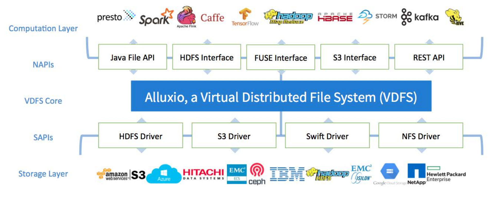
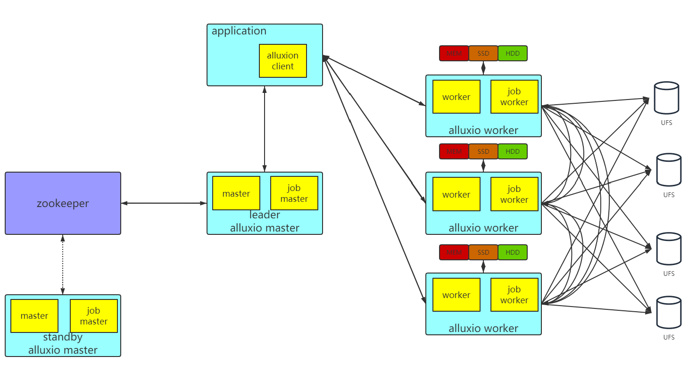
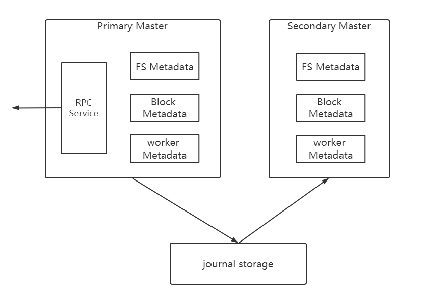
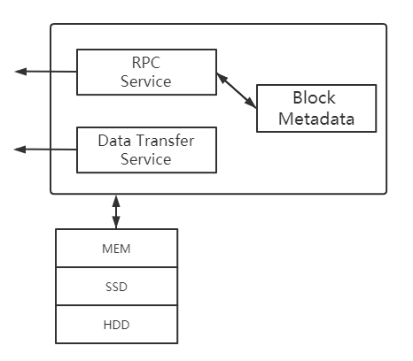

<h1><center>Alluxio研究</center></h1>

# 目录
* 1.概述
* 2.系统架构
* 3.与底层文件系统集成
* 4.与计算组件集成
* 5.性能测试
  
# 1.概述

> &emsp;&emsp;过去的一段时间里分布式计算引擎和分布式存储出现了很多重大创新。在数据计算层，从最开始的MR，到现在的Spark,Flink,Presto等，已经出现了上百个不同的计算框架；在数据存储层，用户可以选择HDFS,S3,NFS,Ceph,GlusterFS等。计算框架和存储系统发展的同时，也为我们带来了一些挑战：
* 数据共享和管理

    &emsp;&emsp;许多公司内部不止使用一种文件系统，多用文件系统增加了管理难度，同时文件系统之间数据如何共享成为一个问题；

* 性能

    &emsp;&emsp;应用上云是一种趋势，数据存储在不同的数据中心，网络带宽将成为提升应用性能的瓶颈；

* 灵活性

    &emsp;&emsp;随着生态系统的发展，在现有架构中引入新技术将会带来许多额外的工作，比如引入新的存储系统后可能会不兼容现有应用程序；

&emsp;&emsp;Alluxio在此背景下应运而生。Alluxio不是一个持久化的存储系统，它是一个以内存为中心的分布式虚拟存储系统，可以理解为一个分布式的缓存系统。在计算层，Alluxio可以提供快速的数据存储和方便的数据共享功能，当应用程序访问的数据位于本地Alluxio worker节点上时，能够提供内存级的数据访问速度，当应用程序访问的数据位于远程Alluxio worker节点上时，数据访问速度取决于网络带宽；对于存储层，Alluxio为应用程序隐藏了具体的存储系统，可以作为多种存储系统的访问入口。

<div class="center">
    
</div>   


# 2.系统架构

&emsp;&emsp;Alluxio的系统架构类似与Hadoop,也是采用了分布式主从系统架构，包含master、worker、clent和UFS。master和worker进程通过RPC相互通信协作，构成了Alluxio服务端。应用程序通过Alluxio Client来和Alluxio服务交互，读写数据或操作文件、目录。一般Alluxio Client需要被放置于使用Alluxio服务的应用进程内部或classpath中。

<div class="center">
    
</div>

## 2.1.Alluxio master

&emsp;&emsp;Alluxio master负责**元数据管理和客户端请求**。在Alluxio文件系统的内部，每一个文件被划分为一个或多个数据块，并以数据块为单位存储在worker节点中。 worker 定期向 master 发送心跳消息汇报自己的状态。master通常不会主动与其他组件通信，只通过RPC服务被动响应请求。同时master还负责实时记录文件系统的日志，以保证集群重启之后可以准确恢复文件系统的状态。**Alluxio支持同时运行多个master节点，避免master成为Alluxio单点错误瓶颈，从而实现 Alluxio 服务的高可用性**。当运行多个 master 的时候，有一个master会被选举为Primary Master，而其余的master则处于standby状态，称为secondary master。当Primary Master因为某些缘故中止运行时，一个secondary master将被选为secondary master服务器。此外，secondary master还需要将文件系统日志写入持久化存储，从而在多master间共享日志，以允许master在进行主从切换时可以恢复对外服务master的状态信息。Alluxio集群中可以有多个secondary master。每个 secondary master定期压缩文件系统日志并生成 Checkpoint以便将来的快速恢复，并在切换成Primary Master的时候重播前Primary Master写入的日志。secondary master不会处理来自任何Alluxio组件的任何请求。

<div class="center">
    
</div>

**面临的挑战：**
* 如何管理大规模的元数据？
* 如何缩短Alluxio Master的启动时间

**大规模元数据管理：**
* 元数据分区，不同的分区数据存放在不同的服务器上，通过一个主服务器对外提供服务

* 设置多个服务器，不同的服务器服务于命名空间内不同的部分。例如RBF。

**&emsp;&emsp;Alluxio为了简化系统结构，没有选择上述方法，而是将元数据存放在磁盘上。如何保证文件系统的访问性能？**

* 1.选择RocksDB

    RocksDB对写操作、单条查询、范围扫描操作性能较高。

* 2.冷热元数据分离存储
  
  元数据从RocksDB读取和写入过程中需要经过反序列化和序列化的过程，比较耗费CPU资源，测试数据显示会占用50%的CPU资源.为了解决这个问题，Alluxio选择将最近访问的数据存放在堆内，其余数据存放到RocksDB中。

* 3.锁优化

**缩短Alluxio Master的启动时间：**   

    //todo

    借用RocksDB备用引擎的功能。

## 2.2.Alluxio worker

&emsp;&emsp;Alluxio Worker负责具体文件的传输任务。每一个worker负责管理分配给Alluxio的本地存储资源（例如，内存RAM、固态闪存SSD、硬盘等HDD），记录所有被管理的数据块的元数据，并根据client对数据块的读写请求做出响应。由于RAM通常提供的存储容量有限，因此在Alluxio Worker空间已满的情况下添加新的数据块时，需要替换已有的数据块。Alluxio Worker采用可配置的缓存替换策略来决定在Alluxio空间中保留哪些数据块。


<div class="center">
    
</div>

* 单层存储（推荐）

    * 仅使用内存（默认）

        Alluxio将为每个worker提供一个ramdisk，并占用一定的系统内存。这个ramdisk将被用作分配给每个Alluxio Worker的唯一存储介质。通过Alluxio的alluxio-site.properties配置文件进行配置：

        ```shell
            alluxio.worker.tieredstore.levels=1
            alluxio.worker.tieredstore.level0.alias=MEM
            alluxio.worker.tieredstore.level0.dirs.path=/mnt/ramdisk
            alluxio.worker.tieredstore.level0.dirs.quota=90GB
        ```


    * 使用多种存储介质

        指定多个存储介质，如 ramdisk 和 SSD.

        ```shell
            alluxio.worker.tieredstore.level0.dirs.path=/mnt/ramdisk,/mnt/ssd,/mnt/hdd
            alluxio.worker.tieredstore.level0.dirs.quota=90GB,512GB,1TB
        ```


* 多级存储

    使用配置参数开启分层存储，Alluxio对于层级数量不做限制

    ```shell
        alluxio.worker.tieredstore.levels=3
        //内存
        alluxio.worker.tieredstore.level0.alias=MEM
        alluxio.worker.tieredstore.level0.dirs.path=/mnt/ramdisk
        alluxio.worker.tieredstore.level0.dirs.quota=90GB
        alluxio.worker.tieredstore.level0.watermark.high.ratio=0.9
        alluxio.worker.tieredstore.level0.watermark.low.ratio=0.7
        //SSD
        alluxio.worker.tieredstore.level0.alias=SSD
        alluxio.worker.tieredstore.level1.dirs.path=/mnt/ssd
        alluxio.worker.tieredstore.level1.dirs.quota=90GB
        alluxio.worker.tieredstore.level1.watermark.high.ratio=0.9
        alluxio.worker.tieredstore.level1.watermark.low.ratio=0.7
        //HDD
        lluxio.worker.tieredstore.level2.alias=HDD
        alluxio.worker.tieredstore.level2.dirs.path=/mnt/ssd
        alluxio.worker.tieredstore.level2.dirs.quota=90GB
        alluxio.worker.tieredstore.level2.watermark.high.ratio=0.9
        alluxio.worker.tieredstore.level2.watermark.low.ratio=0.7
    ```


## 2.3.Alluxio client

&emsp;&emsp;Alluxio Client帮助用户与Alluxio服务端进行交互。它发起与master的通信以执行元数据操作，并从worker读取和写入存储在Alluxio中的数据。当Alluxio的客户端和Alluxio Worker运行在同一台节点上的时候，客户端对本地 worker 缓存数据的读写请求可以绕过其 RPC 接口，使用本地文件系统直接访问worker所管理的数据。这种读写被称为短路读写，通常可以达到很高的速度。如果该节点上没有Alluxio Worker运行，所有的读写都需要通过网络访问在其他节点上的worker，速度通常受网络带宽限制。


## 2.4.Alluxio 读写流程

### 2.4.1.读流程

* 命中本例Alluxio Worker

    应用程序需要读取的数据已经被缓存在本地Alluxio Worker上。短路读可以避免通过TCP socket传输数据，并能够提供内存级别的数据访问速度。短路读是从Alluxio读取数据的最高性能方式。

* 命中远程Alluxio Worker

    client请求的数据不在本地Alluxio Worker上，而在集群中某一远端worker中。Alluxio Worker除将数据返回到客户端外，还将在本地写入一个副本以便将来可以从本地读取。这样会造成该数据产生一个额外的副本。所以被请求得越频繁的数据，就会有越多的 Alluxio 缓存副本，从而实现了根据数据热度优化计算的本地性。可以指定使用NO_CACHE的读取方式来禁用本地副本的写入。
    远程缓存命中情况的数据读取速度通常受网络速度限制。由于 Alluxio Worker之间的网络速度通常比Alluxio Worker与底层存储之间的速度快，因此Alluxio会优先考虑从远程worker存储中读取数据。


* 未命中Alluxio

    请求的数据没有被缓存在Alluxio中,应用程序将必须从底层存储中读取数据。缓存未命中通常发生在第一次读取数据，或者曾经缓存的数据被置换出Alluxio空间后。

### 2.4.2.写流程

* 仅写缓存

    Alluxio客户端仅将数据写入本地Alluxio Worker，并不会将数据写入底层存储系统。在写入之前，Alluxio 客户端将在 Alluxio Master上创建元数据；在写入期间，如果“短路写”可用，Alluxio客户端直接将数据写入本地RAM盘上的文件，绕过Alluxio Worker以避免较慢的网络传输。短路写能够以内存速度执行，是性能最高的写入方式。由于数据并没有持久化地写入存储，如果机器崩溃或需要释放数据以用于较新的写入，则数据可能会丢失。

* 写缓存与持久化存储

    数据将同步写入Alluxio Worker和底层存储系统。Alluxio客户端将写入委托给本地worker，而worker将同时写入本地内存和底层存储。由于写入持久化存储通常会比写入本地存储慢得多，因此客户端写入速度与底层存储的写入速度相匹配。当需要保证数据持久性时，建议使用CACHE_THROUGH写入类型。

* 仅写持久化存储

    Alluxio客户端将通过Alluxio Worker将数据仅写入底层存储系统，客户端写入速度与底层存储的写入速度相仿，并且不会创建Alluxio存储中的副本。

* 异步写回持久化存储

    数据将同步写入Alluxio Worker，并异步写入底层存储系统，以内存速度提供数据写入，并仍然以异步的方式完成数据持久化。如果机器在异步持久存储到底层存储之前崩溃，数据仍然会丢失。异步写机制要求文件的所有块必须驻留在同一个worker中。


# 3.与底层文件系统的集成

* 支持的底层文件系统
  * S3
  * HDFS
  * NFS
  * Kodo
  * Ceph
  * GlusterFS
  * ...

* 在启动Alluxio之前，需要指定Alluxio的根目录，在conf/alluxio-site.properties指定。例如：
    
**&emsp;&emsp;&emsp;alluxio.master.mount.table.root.ufs=hdfs://manager.bigdata:8020**

&emsp;&emsp;&emsp;如果Alluxio是单机模式的话也可以将Linux本地目录指定为Alluxio的根目录。

* 可以将不同的底层文件系统理解为Linux系统中不同的磁盘，通过挂载的方式将底层文件系统挂载到Alluxio文件系统中。

    `bin/alluxio fs mount allusioPath UFSPath`

* 元数据一致性
  
 &emsp;&emsp;除了alluxio提供的统一名称空间之外，alluxio挂载的每个底层文件系统都有自己的名称空间。在不通过alluxio的情况下更改了UFS名称空间中的文件，Alluxio提供一种同步机制在两个命名空间中进行同步。

  **&emsp;&emsp;alluxio.user.file.metadata.sync.interval**:配置缓存的副本的生存期。默认值为-1，表示在初始加载后不再重新同步元数据，值为0表示每次操作都同步元数据，间隔越低，alluxio越快发现UFS的外部修改，但会降低性能。

* 对于HDFS,alluxio支持主动同步，Alluxio注册监听器，可以监听HDFS上的任何改动，当HDFS发生改动时，alluxio会进行同步。

    `bin/alluxio fs startSync /syncDir`


# 4.与上层计算框架的基层

Alluxio支持的计算框架包括：Spark,Presto,MR,Hive,HBase,Tensorflow,Spark on Kubernets,深度学习框架。

## 4.1.与Hive的集成

* 将Alluxio客户端上传到每一个hive的节点上hiveserver2,hive metastore,hive cli,exection engine。
* 在hive-env.sh中更新HIVE_AUX_JARS_PATH的值：export HIVE_AUX_JARS_PATH=alluxio-2.3.0-client.jar:${HIVE_AUX_JARS_PATH}
* 重启Hive

## 4.2.与Spark集成

* 将在Alluxio客户端加入Drivers和excutors的classpath中：
  
  spark.driver.extraClassPath /<PATH_TO_ALLUXIO>/client/alluxio-2.4.1-client.jar

  spark.executor.extraClassPath /<PATH_TO_ALLUXIO>/client/alluxio-2.4.1-client.jar


<style>
    .indentation_1 {
    width: auto;
    display: table;
    margin-left: 1cm;
    margin-right: auto;
    }
    .indentation_2 {
    width: auto;
    display: table;
    margin-left: 1.5cm;
    margin-right: auto;
    }
    .indentation_3 {
    width: auto;
    display: table;
    margin-left: 2cm;
    margin-right: auto;
    }
    .center {
    width: auto;
    display: table;
    margin-left: auto;
    margin-right: auto;
    }
</style>