<h1>
Alluxio 性能测试(一)
</h1>
<h3>
存算分离场景
</h4>

## 物理机配置
  
  本次测试8台物理机配置相同：

cpu|物理核数|processor|mem|HDD|
|:-:|:-:|:-:|:-:|:-:|
Intel(R) Xeon(R) Gold 5120 CPU @ 2.20GHz|2|56|256G|1.1T*7| 

 

## 集群规划

    一个管理节点，四个计算节点，三个存储节点。存储节点和计算节点分离部署，计算节点和Alluxio集群并置部署。

IP|hostname|role|service
|:-:|:-:|:-:|:-:|
192.168.1.3|manager.bigdata|管理节点|Namenode,resourcemanager,spark client,alluxio master
192.168.1.4|worker1.bigdata|计算节点|nodemanager,alluxio worker
192.168.1.5|worker2.bigdata|计算节点|nodemanager,alluxio worker
192.168.1.6|worker3.bigdata|计算节点|nodemanager,alluxio worker
192.168.1.7|worker4.bigdata|计算节点|nodemanager,alluxio worker
192.168.1.8|worker5.bigdata|存储节点|datanode
192.168.1.9|worker6.bigdata|存储节点|datanode
192.168.1.10|worker7.bigdata|存储节点|datanode

 

### 测试结果

* tpc-ds单条sql：query4

    

    |*|第一次(s)|第二次(s)|第三次(s)|第四次(s)|
    |:-:|:-:|:-:|:-:|:-:|
    spark without alluxio|189.908|77.69|77.341 |77.072 ||
    spark with alluxio|249.513|85.426|82.482 |78.778||

    

    * 磁盘IO

        

            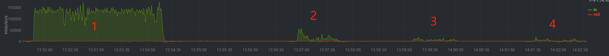
        

        

            图一 spark without alluxio-存储节点
        

        

            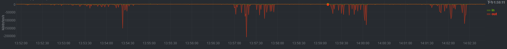
        

        

            图二 spark without alluxio-计算节点
        

        

            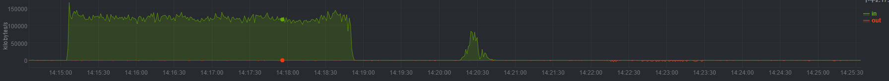
        

        

            图三 spark with alluxio-存储节点
        

        

            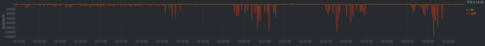
        

        

            图四 spark with alluxio-计算节点
        

    * 网络IO

        

            
        

        

            spark without alluxio-存储节点
        

        

            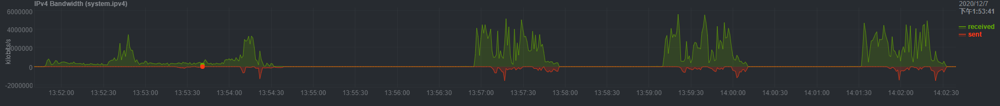
        

        

            spark without alluxio-计算节点
        

        

            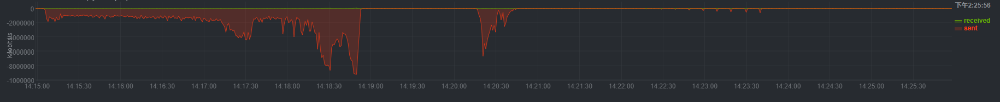
        

        

            spark with alluxio-存储节点
        

        

            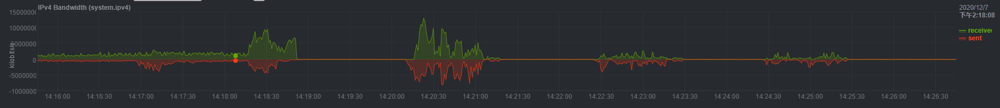
        

        

            spark with alluxio-计算节点
        

    **1. spark without alluxio时：第一次执行查询任务时，数据需要从存储节点的磁盘上读取数据，因此执行时间较长，后面几次由于缓存的作用，数据不再直接从磁盘读取（如图1所示），因此执行时间变短。多次执行之后，查询时间稳定在77s左右。**

    **2. spark with alluxio时：第一次执行查询任务时，数据需要通过Alluxio Worker从存储节点的磁盘上读取数据，因此时间也比较长，而且比spark without alluxio查询时间还要长。后面由于数据被存储到Alluxio Worker节点上，因此数据直接从Alluxio Worker上获取数据，因此存储节点的磁盘IO使用率就减少了（如图三所示）。多次执行之后，查询时间稳定在78s左右。**

    **3. 通过对比数据可以发现在集群空载运行时，没有系统缓存时spark with alluxio性能提升141%。有系统缓存后，spark with alluxio对spark查询性能没有提升，甚至有所下降。原因分析：**

    * Alluxio监控显示没有发生shorr-circuit read，因此数据全部通过网络从远程Alluxio Worker节点传输。由于缓存的作用，spark without alluxio也是通过网络从存储节点的内存中读取数据。因此性能相仿。

    **HDFS集群有负载时query4查询时间对比：**

    

    |*|第1次(s)|第2次(s)|
    |:-:|:-:|:-:|:-:|
    spark without alluxio|233.348 |98.603|
    spark with alluxio| 95.781|95.001|

    

    

            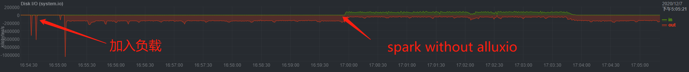
    

    

            集群加上负载时磁盘IO
    

* tppc-ds前10条sql

    

    |*|第一次(s)|第二次(s)|
    |:-:|:-:|:-:|
    spark without alluxio|267.876|166.265 |
    spark with alluxio|172.532|172.803|

    

### 结论

* 没有系统缓存时，spark with alluxio性能提升明显。
* 系统缓存起作用时，spark with alluxio没有性能提升，主要原因在于没有short-circuit read发生。如果应用程序需要读取的数据已经被缓存在本地Alluxio Worker上。短路读可以避免通过TCP socket传输数据，并能够提供内存级别的数据访问速度。短路读是从Alluxio读取数据的最高性能方式。

### 问题排查

&emsp;&emsp;通过分析spark ui页面提供的信息以及yarn日志，发现部分数据是从本地加载的。如下图所示：

    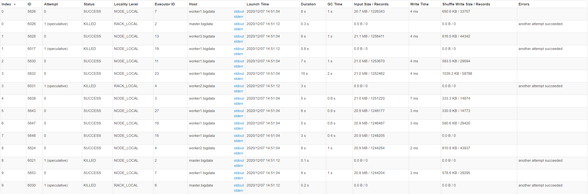

            spark with alluxio-sparkUI

    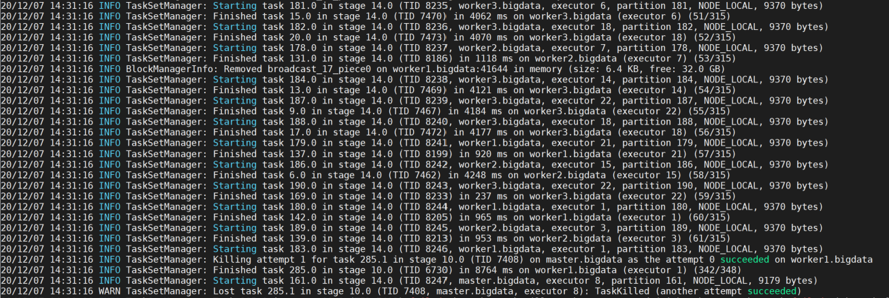

            spark with alluxio-yarn log

**&emsp;&emsp;1.通过上面两个图可以看到程序运行过程当中部分数据是从本地加载的，但是程序运行中产生的RDD也会从本地计算节点加载。所以无法判断元数据是否是从本地加载进来的。**

    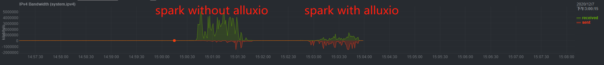

            计算节点网络接口监控

**&emsp;&emsp;2.计算节点网络接口监控显示spark without alluxio时，数据通过网络从存储节点传输到计算节点；spark with alluxio时，也有数据通过网络传输到计算节点，但是数据量小很多，所以推测有部分数据确实是通过本地加载的。但是从得到的性能数据上看，数据因该没有命中本地worker，还是通过网络传输的数据。**

**&emsp;&emsp;4.没有发生short-circuit read，可能的原因有两个：**

* Alluxio缺少相关配置
* yarn调度策略有问题。

   *&emsp;&emsp;通过hive客户端查询数据时，可以监控到有short-circuit read，但是提交到yarn的所有任务都没有short-circuit read。*

**&emsp;&emsp;目前已经定位到Alluxio中读数据相关代码，待调试后查明原因。**

  
 

