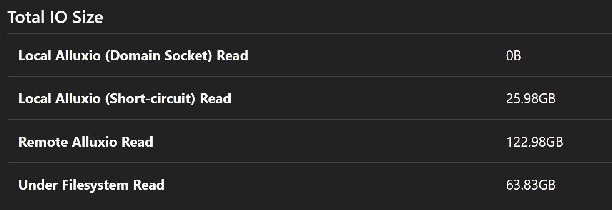

<h1><center>Alluxio 性能测试(二)<center></h1>
<h3><center>存算分离场景<center></h4>

> &emsp;&emsp;在Alluxio性能测试（一）中，Alluxio提供的监控显示提交到YARN上的所有任务均没有通过short-circuit read的方式加载数据，而short-circuit read可以避免通过TCP socket传输数据，并能够提供内存级别的数据访问速度，是从Alluxio读取数据的最高性能方式。因此本次测试主要排查数据没有通过short-circuit read加载的原因。

&emsp;&emsp;经过分析，Alluxio提供的显示数据没有通过short-circuit read加载的原因有三个：
* YARN调度策略不对导致本地性较差。
* 缺少Alluxio配置参数导致监控信息缺失
* Alluxio监控功能有bug

<h3><center>测试一</center></h3>

&emsp;&emsp;分别在spark with alluxio和spark without alluxio场景下提交相同的spark sql查询任务，监控计算节点网卡流量（如下图所示）。通过对比可以得出结论，**spark with alluxio时，只有少量数据通过网络传输，大部分数据应该是从本地加载的，Alluxio没有监控到这部分信息。**

<div class="center">
    
</div>

<div class="center">
            计算节点网络接口监控
</div>

<h3><center>测试二</center></h3>
&emsp;&emsp;此次测试通过追踪Alluxio读数据的代码定位问题。

* Alluxio客户端通过AlluxioBalockStore对象获取文件块的位置信息：

    `List<BlockLocation> locations = info.getLocations();`

    `locations = locations.stream()
                .filter(location -> workers.contains(location.getWorkerAddress())).collect(toList());`

* 如果获取的locations不为空，从获取的块信息中计算最近的文件块。

    `Optional<Pair<WorkerNetAddress, Boolean>> nearest =
                    BlockLocationUtils.nearest(mTieredIdentity, tieredLocations, mContext.getClusterConf());`

* 返回的nearest中包含两个重要信息：

    ```
    //dataSource是WorkerNetAddress的一个实例:
    例如：WorkerNetAddress{host=master.bigdata, containerHost=, rpcPort=29999, dataPort=29999, webPort=30000, domainSocketPath=, tieredIdentity=TieredIdentity(node=master.bigdata, rack=null)}

    //dataSourceType是一个枚举类型：LOCAL, REMOTE, UFS。根据nearest返回值确定是LOCAL还是REMOTE

    ```

    `dataSource = nearest.get().getFirst();`

    `dataSourceType =nearest.get().getSecond() ? BlockInStreamSource.LOCAL : BlockInStreamSource.REMOTE;`

* 如果获取的locations为空或者经过上面几步程序后获取到的dataSource为空,则设置dataSourceType为UFS

    ```
        if (dataSource == null) {
            dataSourceType = BlockInStreamSource.UFS;
            ...
        }
    ``

* 最后根据dataSource, dataSourceType等信息创建stream

    `return BlockInStream.create(mContext, info, dataSource, dataSourceType, options);`

* BlockInStream中会根据传入的参数创建两种reader
    * LocalFileDataReader

        `return createLocalBlockInStream(context, dataSource, blockId, blockSize, options);`

        通过LocalFileDataReader加载数据的方式即为short-circuit read

        ```
            @Override
             public boolean isShortCircuit() {
                return true;
            }

        ```

    * GrpcDataReader

        `return createGrpcBlockInStream(context, dataSource,dataSourceType, builder.buildPartial(),
        blockSize, options);`

* 我们分别在createLocalBlockInStream和createGrpcBlockInStream方法前增加debug日志。然后在运行任务的日志中可以发现是通过LocalFileDataReader的方式加载的数据

    `20/12/08 19:09:58 WARN BlockInStream: -------------ljk-debug-----------create stream for short-circuit read!`


**&emsp;&emsp;通过排查代码发现我们在Alluxio Master节点中设置的参数alluxio.user.metrics.collection.enabled=true并没有被加载到应用程序中。通过手动传递参数的方式修改此参数的值，Alluxio监控页面可以看到数据是通过short-circuit read的方式加载的。**

**&emsp;&emsp;后续测试如果默认开启alluxio.user.metrics.collection.enabled对性能影响不大的话，我们会将alluxio.user.metrics.collection.enabled的默认值改为true**

```
    public static final PropertyKey USER_METRICS_COLLECTION_ENABLED =
      new Builder(Name.USER_METRICS_COLLECTION_ENABLED)
          .setDefaultValue(false)//现在默认值为false
          .setDescription("Enable collecting the client-side metrics and heartbeat them to master")
          .setConsistencyCheckLevel(ConsistencyCheckLevel.WARN)
          .setScope(Scope.CLIENT)
          .build();
```

**&emsp;&emsp;将alluxio.user.metrics.collection.enabled默认值改为true后，不用指定参数Alluxio可以监控到数据是通过short-circuit的方式加载或上传数据。**

<div class="center">
    
</div>

<div class="center">
            Alluxio监控
</div>

## 结论

&emsp;&emsp;提交到YARN上的任务,在Alluxio提供的监控上虽然没有显示通过short-circuit read的方式加载数据，但实际确实是通过short-circuit read的方式加载的数据。        

<style>
    .indentation_1 {
    width: auto;
    display: table;
    margin-left: 1cm;
    margin-right: auto;
    }
    .indentation_2 {
    width: auto;
    display: table;
    margin-left: 1.5cm;
    margin-right: auto;
    }
    .indentation_3 {
    width: auto;
    display: table;
    margin-left: 3cm;
    margin-right: auto;
    }
    .center {
    width: auto;
    display: table;
    margin-left: auto;
    margin-right: auto;
    }
</style>