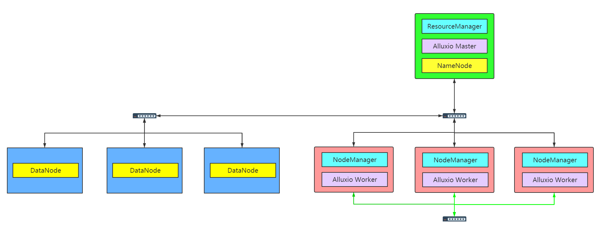

### 集群拓扑

    

### 机器配置

* 计算节点

    

    |内存|AEP|
    |:-:|:-:|
    |384G|512G

    

    

* 存储节点

    

    |内存|磁盘|
    |:-:|:-:|
    |128G|1T*6|

    

* 管理节点

    

    |内存|
    |:-:|
    |256G|

    

### 对比测试

 

**资源配置**

|yarn|alluxio|
|:-:|:-:|
|128G|256G|

 

* Alluxio空间能够缓存所有数据(300G数据、500G数据)

    * 300G数据

        存储节点能够缓存所有数据时，此时spark with alluxio是否有性能提升

    * 600G数据

        存储节点不能缓存所有数据，Alluxio可以缓存所有数据，spark with alluxio性能提升是否明显

* Alluxio空间不足（1T数据）

    Alluxio不能缓存所有数据时，不同的cache策略对性能的影响

* Alluxio+AEP
  * 2T数据，可以缓存所有数据

    * 单层存储

        AEP作为内存使用

        AEP作为SSD使用，Alluxio单层存储配置两种不同的存储介质RAM、SSD

    * 多级存储

        AEP作为SSD使用，第一层配置RAM，第二层配置SSD

  * 4T数据 ，不能缓存所有数据
    

