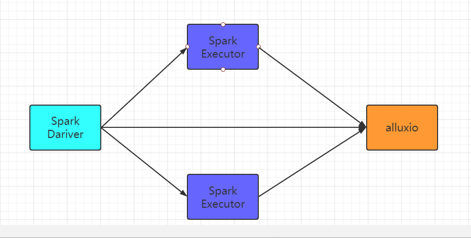
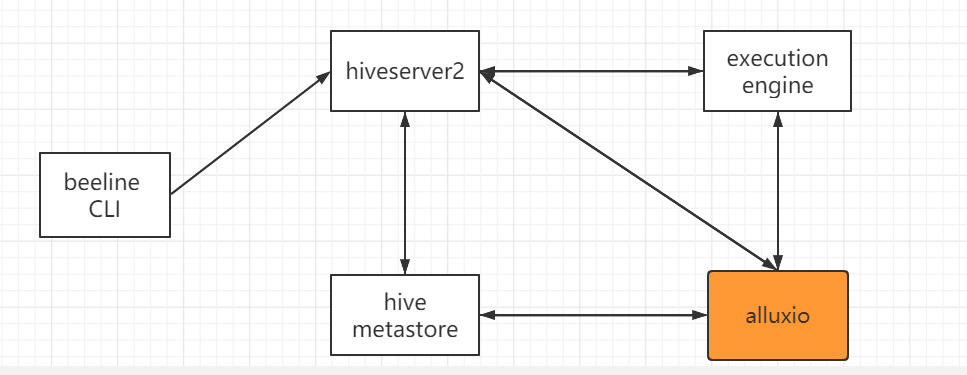

# 计算框架
* hadoop兼容客户端
* 本地Java客户端
* S3A接口
* REST网络服务
* FUSE接口
> * 应用程序必须使用alluxio关键字，alluxio://host:port/...
> * 所有访问alluxio的JVM必须在classpath中包含alluxio客户端的jar

# spark
> * spark默认使用hdfs://ip:port/path...操作HDFS文件系统
> * 是用spark+alluxio的话，在Drivers和excutors中都要求alluxio客户端jar在classpath中（spark/conf/spark-defaults.conf）：
>   * spark.driver.extraClassPath   /<PATH_TO_ALLUXIO>/client/alluxio-2.4.1-client.jar
>   * spark.executor.extraClassPath /<PATH_TO_ALLUXIO>/client/alluxio-2.4.1-client.jar

*分发jar包*
* 将alluxio/client/alluxio-2.3.0-client.jar分发到所有节点的spark2/jars/目录下
# hive

*分发jar包*
* aullxio客户端必须在每一个hive的节点上hiveserver2,hive metastore,hive cli,exection engine
* 在hive-env.sh中更新HIVE_AUX_JARS_PATH的值：export HIVE_AUX_JARS_PATH=alluxio-2.3.0-client.jar:${HIVE_AUX_JARS_PATH}
* 需要重启hive

**使用**
* 查询内部或者外部表，数据会缓存到alluxio内存中
* 删除内部表，alluxio数据会被删除，删除外部表，alluxio数据不会被删除
## 将现有的HDFS表映射到alluxio
* 将现有的表从HDFS移动到alluxio:`alter table hive_test set location "alluxio://ip:port/path...";`
* 将原有的HDFS数据集路径挂载到alluxio中：bin/alluxio fs mount /alluxioPath hdfs://host:port/HDFSPath
* 查询该表，数据会被缓存到alluxio内存中
# presto
`todo`