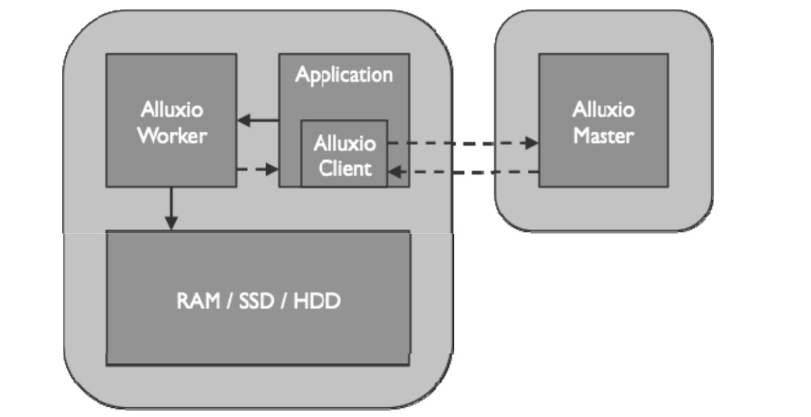
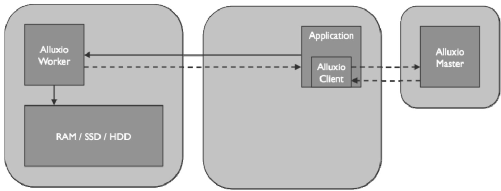
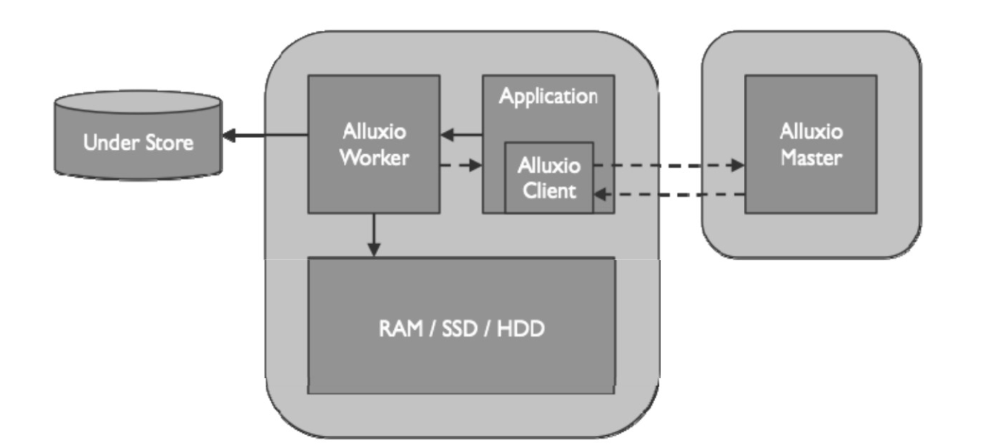
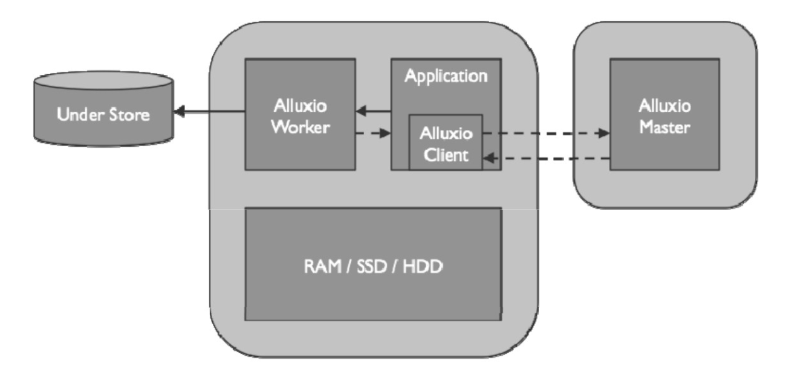

> 用户同样可以通过选择不同的缓存类型来设置数据的写入方式。具体地，用户可以通过Alluxio API或在客户端中配置属性alluxio.user.file.writetype.default来设置写入类型。本节将介绍不同写入类型的行为及其对应用程序的性能影响

# MUST_CACHE
    Alluxio客户端仅将数据写入本地Alluxio Worker，并不会将数据写入底层存储系统
    在写入之前，Alluxio 客户端将在 Alluxio Master上创建元数据；在写入期间，如果“短路写”可用，Alluxio客户端直接将数据写入本地RAM盘上的文件，绕过Alluxio Worker以避免较慢的网络传输。
    由于数据并没有持久化地写入存储，如果机器崩溃或需要释放数据以用于较新的写入，则数据可能会丢失
**流程图**

    当客户端的本地机器上没有 Alluxio Worker 的时候，可以通过写入远端的Alluxio Worker完成写缓存，如图2-13所示。这种情况下的写速度因为通过网络，通常比短路写的速度慢
**流程图**

# CACHE_THROUGH
    数据将同步写入Alluxio Worker和底层存储系统
    Alluxio客户端将写入委托给本地worker，而worker将同时写入本地内存和底层存储
**流程图**

# THROUGH
    Alluxio客户端将通过Alluxio Worker将数据仅写入底层存储系统,因此客户端写入速度与底层存储的写入速度相仿
**流程图**

# ASYNC_THROUGH
    数据将同步写入Alluxio Worker，并异步写入底层存储系统.①如果机器在异步持久存储到底层存储之前崩溃，数据仍然会丢失。②异步写机制要求文件的所有块必须驻留在同一个worker中。
# 定位策略
*选择在哪些worker上存储数据*
* LocalFirstPolicy
* MostAvailableFirstPolicy
* RoundRobinPolicy
* SpecificHostPolicy
# 写入层级
* alluxio.user.file.write.tier.default
* 适用于本地worker，远程worker默认写入最高层

