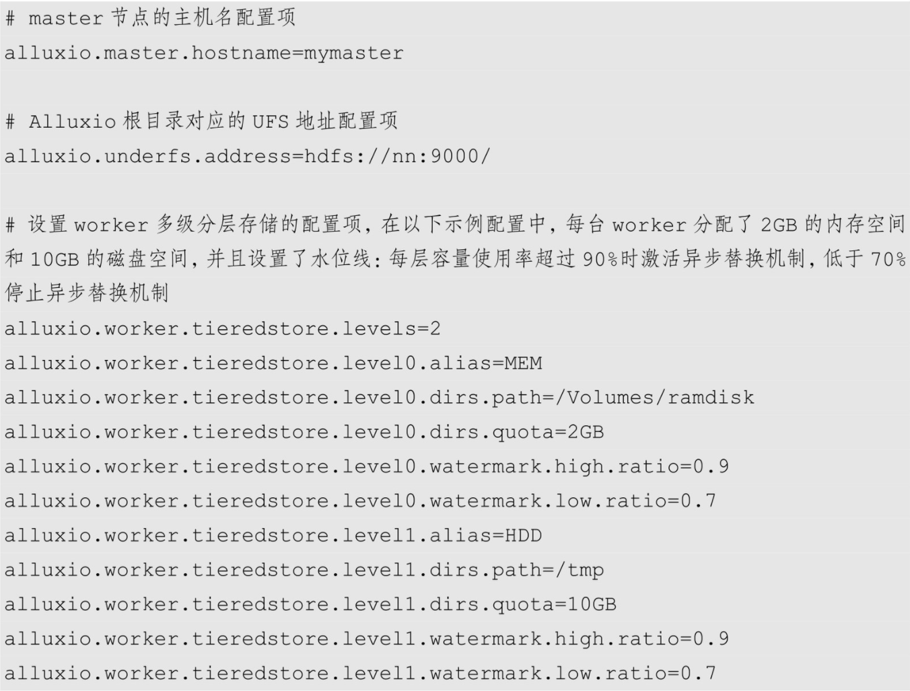

**属性次序优先级**

> JVM系统参数 > 系统环境变量 > 参数配置文件> 集群默认值

# 配置方式
## 使用Site-Property文件

## 使用环境变量配置
环境变量|意义
-|-|
ALLUXIO_CONF_DIR|alluxio配置目录的路径
ALLUXIO_LOGS_DIR|logs目录路径
ALLUXIO_MASTER_HOSTNAME|alluxio master主机名
ALLUXIO_UNDERFS_ADDRESS|底层存储系统地址
ALLUXIO_RAM_FOLDER|worker 保存in-memory数据的目录
ALLUXIO_JAVA_OPTS|
ALLUSIO_MASTER_JAVA_OPTS|
ALLUXIO_WORKER_JAVA_OPTS|
ALLUSIO_USER_JAVA_OPTS|
ALLUXIO_CLASSPATH|alluxio进程额外的classpath
ALLUXIO_LOGSERVER_HOSTNAME|
ALLUXIO_LOGSERVER_PORT|
ALLUXIO_LOGSERVER_LOGS_DIR|
    用户可以通过 shell 命令或 conf/alluxio-env.sh 文件设置这些环境变量
# Alluxio客户端组件参数的配置
## Alluxio客户端组件参数的配置
### Alluxio Shell命令的配置方式
    用户可以在输入fs命令的子命令之前（如copyFromLocal）将JVM系统属性-Dproperty=value 加入命令行中，以指定相应的引用属性。例如：    
`bin/alluxio fs -Dalluxio.user.file.writetype.default=CACHE_THROUGH copyFromLocal README.md /README.md`
### Spark任务的配置方式
    Spark用户可以通过对Spark executor的spark.executor.extraJavaOptions和Spark driver的spark.driver.extraJavaOptions 属性添加"-Dproperty=value"，从而向Spark job传递JVM环境参数
```shell
spark-submit --conf 'spark.driver.extraJavaOptions=-Dalluxio.user.file.writetype.default=CACHE_THROUGH' \
--conf 'spark.executor.extraJavaOptions=-Dalluxio.user.file.writetype.default=CACHE_THROUGH' \
...
```
```java
val conf = new SparkConf()
            .set("spark.driver.extraJavaOptions","-Dalluxio.user.file.writetype.default=CACHE_THROUGH")
            .set("spark.executor.extraJavaOptions","-Dalluxio.user.file.writetype.default=CACHE_THROUGH")
```
### MapReduce任务的配置方式
    对于 MapReduce任务来说，可以通过提交 MR 任务时候的-D选项来告诉这个任务所有的 task 所要使用的 Alluxio 客户端选项。Hadoop MapReduce 用户可以在hadoop jar 或 yarn jar 命令后添加"-Dproperty=value"，属性将被传递给这个作业的所有任务中.
```shell
hadoop jar libexec/share/hadoop/mapreduce/hadoop-mapreduce-examples-2.7.3.jar wordcount \
-Dalluxio.user.file.writetype.default=CACHE_THROUGH \
-libjars client/alluxio-2.3.0-client.jar \
<INPUT_FILES> <OUTPUT_FILES>
```
## 使用集群默认的配置方式
    每个Alluxio客户端都可以使用从master节点获取的集群范围的配置值，以此为基础初始化其客户端的配置
# Alluxio参数配置的相关工具
## copyDir
    使用 Alluxio 提供的"bin/alluxio copyDir"脚本，自动地根据 conf/workers 中的内容把 master节点上的配置文件同步到所有的worker节点上.
## getConf
### 检查特定配置属性的值及其来源
```shell
$ bin/alluxio getConf alluxio.worker.port
29998
$ bin/alluxio getConf --source alluxio.worker.port
DEFAULT
```
### 列出所有配置属性来源
```shell
$ bin/alluxio getConf --source
alluxio.conf.dir=/opt/alluxio/conf
alluxio.debug=default
...
```
**使用--master选项，getConf将查询master节点,没有指定--master 选项，此命令则只检查执行该命令节点的本地配置**

# 副本数控制
## 被动副本
    alluxio根据实际情况调整数据的副本数，对用户透明
## 主动副本
* alluxio.user.file.replication.min
* alluxio.user.file.replication.max
`$ bin/alluxio fs setReplication -min 3 -max 5 /file`
