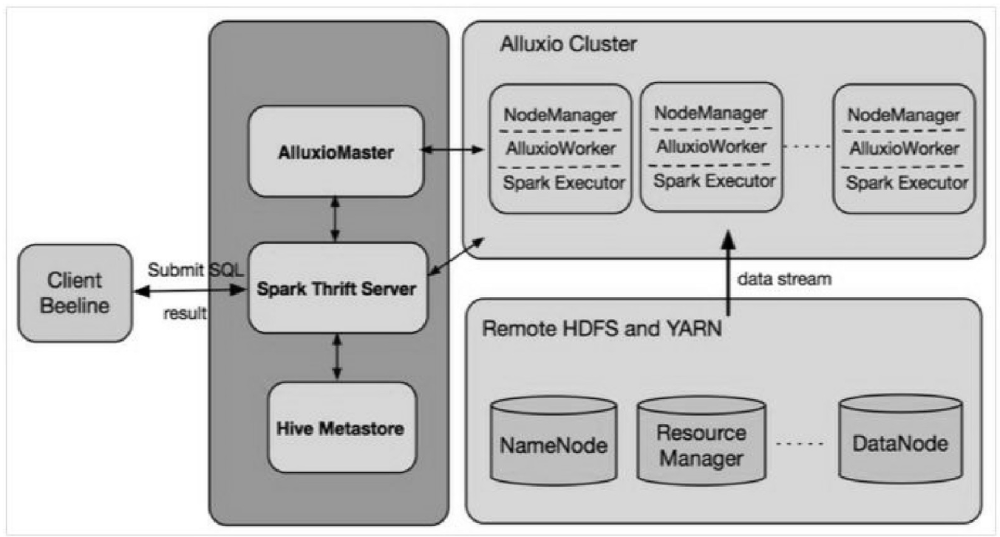

# spark
## 疑问
* 面向读场景的考虑。由于冷读取会触发从远程数据源获取数据，所以在Alluxio上运行的任务性能仍然会优于同一个运行在线上环境的任务吗？
* 是否需要将从远程数据源获取的所有数据全部加载到Alluxio中？
* 面向写场景的考虑。如果最终仍需要将数据写入远程存储（如HDFS），那么为什么需要先写入 Alluxio 再写入 HDFS，而不是直接写入 HDFS？前者显然增加了一些开销。
* 如果先把数据写入Alluxio，那么当一个Alluxio Master或Alluxio Worker节点失败的时候又会发生什么情况？
## 影响写性能的因素
* 集群是否处于繁忙状态
* 网络带宽是否使用率高
* 单机器I/O负载是否过高
* datanode是否发生GC等

*由于影响写性能的因素太多，出于稳定性考虑，alluxio只用作读场景*

> Alluxio非常适合于有经常访问的热数据及应用程序会利用内存缓存的场景。这既避免了从硬盘反复加载和通过网络传输数据的开销，也避免了为很少访问的数据提供过多的内存资源而造成性能限制或资源浪费。

**Ad Hoc查询:即席查询，又叫做用户自定义查询。**

## 部署
*将HDFS datanodes和Alluxio Workers隔离部署*
* 这两个进程都需要硬盘来存储数据，而大量的 I/O 操作可能会导致磁盘故障率的增加
* 为Alluxio Workers提供了专用的硬盘资源用于缓存

