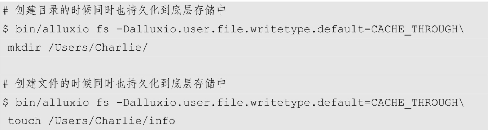
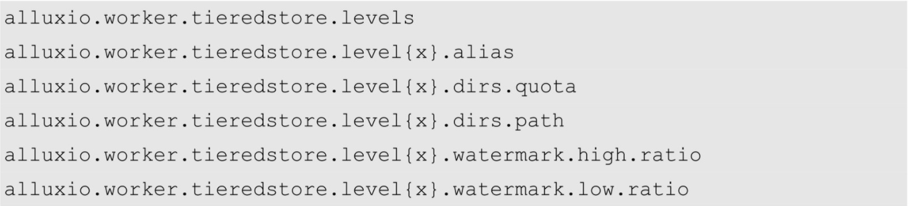
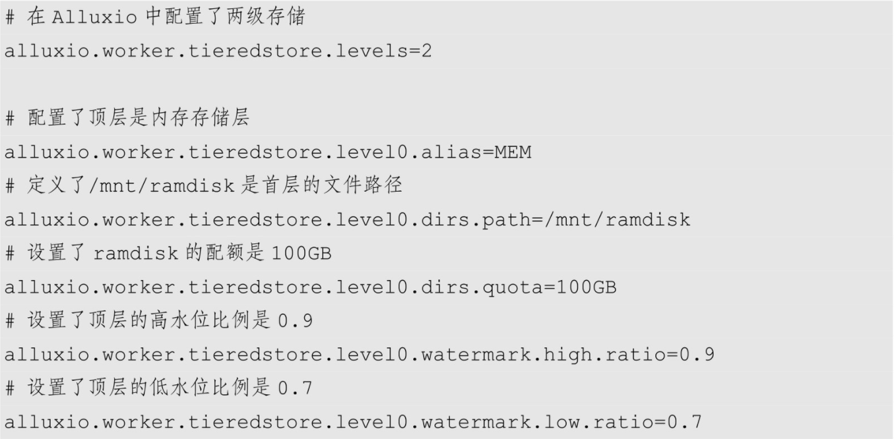
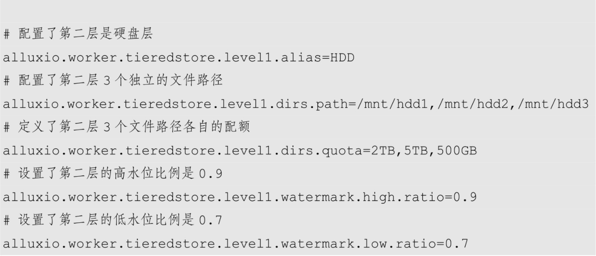
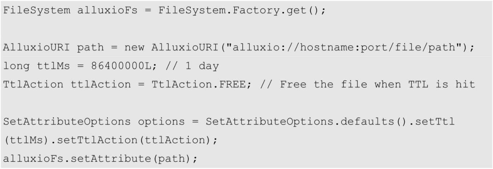

*挂载配置不同的 HDFS时候，可以在挂载的时候特别指定每一个 HDFS 所对应的配置信息*
```shell
$ bin/alluxio fs mount /hdfs2 hdfs://host:port/path... \
--option alluxio.underfs.hdfs.configuration=/path/core-site.xml:/path/hdfs-site.xml
```
*查看挂载点*
```shell
$ bin/alluxio fs mount 
```
*取消挂载点*
```shell
$ bin/alluxio fs unmount /data
```
# Alluxio与底层存储的元数据一致性保证
    当用户挂载底层存储后加载其存储的文件时，或在Alluxio文件系统中创建新文件时，Alluxio 会确保 Alluxio 空间中的文件元数据与底层存储系统里所对应的文件元数据一致，包括文件名、文件大小、创建者、组别等文件信息，以及其所在的目录结构.
    如果用户能够绕过 Alluxio 而直接修改底层存储的文件或目录结构，Alluxio 提供的相应的机制则可以将这些底层存储的更新“同步”到Alluxio层。
## 导入底层存储元数据
    当一个底层存储被挂载到Alluxio后，Alluxio的master节点会在需要的时候读取底层文件系统，并在Alluxio系统中创建对象与之对应
    当该HDFS被挂载后，这些目录及文件第一次被访问时（例如用户请求列出Alluxio根目录下所有文件），Alluxio Master节点会自动读取该HDFS并加载这些对象的元数据
        （1）目录结构会被保持
         (2）该过程中Alluxio并不会加载文件具体数据，而只是加载文件及目录的元数据。例如，Alluxio Shell的ls命令会显示出这些文件的大小、创建用户等信息，但In-Alluxio（Alluxio空间数据）这一比例则依然是0。若要将其文件数据加载到Alluxio，则可以用 Java API 当中的 FileInStream 来读取数据，或者通过输入Alluxio Shell中的load命令进行加载
## Alluxio创建新文件/目录的同步方式
    当在Alluxio文件系统中创建新的文件或目录时，可以设置决定这些对象是否要在底层存储系统中持久化

## 底层存储更新的同步方式
    如果底层存储被其他应用绕过Alluxio而修改了，那么可能会导致Alluxio中存储的该文件的元数据与底层存储中的元数据出现暂时不一致
**alluxio.user.file.metadata.sync.interval**

     (1）取值为-1的时候，Alluxio不会主动去和底层存储做同步。-1为该属性的默认值。
    （2）取值为一个正整数的时候，指定了一个时间窗口的大小。在该时间窗口内，该文件的同步将不会被触发。不难看出，在这种情况下，Alluxio的元数据与底层存储的元数据会在一个在时间窗口内会实现最终一致性
    （3）取值为 0 的时候，每次读取一个 Alluxio 文件或目录的元数据都会强制触发Alluxio Master与底层存储对该文件的同步操作。换言之，时间窗口在这种情况下为0。

    时间窗口的设置是一种性能与一致性的取舍。越小的时间窗口越可能频繁地触发Alluxio访问底层存储。在底层存储的元数据操作较慢的时候，这将会降低Alluxio Master 的性能，但也保证了更强的一致性；反之，越大的时间窗口会减少同底层存储进行元数据同步的频率，提高Alluxio Master的性能，但可能会要求用户的业务功能能够容忍一定程度内的最终一致性。
# Alluxio缓存资源的配置与管理
    Alluxio管理Alluxio Worker的本地存储资源（包括内存）来充当分布式缓存区。该缓存区是在用户应用程序和各种底层存储之间的数据快速访问层，可以在很大限度上提升I/O性能。
## 配置Alluxio缓存存储资源
    每个Alluxio节点管理的存储数量和类型由用户配置决定。Alluxio还支持层次化存储，这使系统存储能够感知介质，让数据存储获得类似于L1/L2 CPU缓存的优化。
### 配置Alluxio Worker单层存储（推荐）
    默认配置下的 Alluxio将为每个worker提供一个ramdisk，并占用一定的系统内存。这个ramdisk将被用作分配给每个Alluxio Worker的唯一存储介质。
    一个常见的修改是显式设置ramdisk的大小。例如，设置每个worker的ramdisk的大小为16GB：
`alluxio.worker.memory.size=16GB`

    指定多个存储介质，如 ramdisk 和 SSD。需要更新alluxio.worker.tieredstore.level0.dirs.path来指定想要的每个存储介质作为存储目录
`alluxio.worker.tieredstore.level0.dirs.path=/mnt/ramdisk,/mnt/ssd1,/mnt/ssd2`

    更新存储介质后，我们需要指出每个存储介质分配了多少存储空间。例如，如果我们想在ramdisk上使用16GB，在每个SSD上使用100GB
`alluxio.worker.tieredstore.level0.dirs.quota=16GB,100GB,100GB`

    Alluxio 在使用mount或 SudoMount 选项启动时会提供并安装 ramdisk。这个 ramdisk 无论在alluxio.worker.tieredstore.level0.dirs.quota中设置的值如何，其大小都由alluxio.worker.memory.size确定。同样，如果要使用除默认的Alluxio提供的ramdisk外的其他设备，Alluxio内存配额的设置则与内存大小无关。
### 配置Alluxio Worker多级存储
**例如，用户经常指定以下几层：①MEM（内存）；②SSD（固态硬盘）；③HDD（硬盘驱动器）**

#### 写数据
*用户写入新数据块时默认写在顶层存储。如果顶层没有足够的空间存放数据块，回收策略会被触发并释放空间给新数据块。如果顶层没有足够的可释放空间，那么写操作会失败。如果文件大小超出了顶层空间，写操作也会失败。*

*用户可以通过配置项设置指定写数据默认的层级。*

*从ReadType.CACHE或ReadType.CACHE_PROMOTE中读数据会导致数据被写到Alluxio中。这种情况下，数据被默认写到顶层。*

*通过load命令可将数据写到Alluxio中。在这种情况下，数据也会被写到顶层。*

#### 读数据
*读取分层存储的数据块和标准Alluxio类似。如果数据已经在Alluxio中，Alluxio从存储位置读取数据块。如果Alluxio配置了多层存储，数据块不一定是从顶层读取，因为可能被透明地移到下层存储中。*

*读取策略为 ReadType.CACHE_PROMOTE时，Alluxio会确保数据在读取前先被移动到顶层存储中。显式地将热数据移到最高层，也可以用于数据块的管理。*

#### 开启和配置分层存储

**例如，想要配置Alluxio使用内存和硬盘，可以使用如下配置**


    定义存储层时有一些限制。Alluxio对于层级数量不做限制，一般是三层——内存、HDD和SDD。最多只有一层可以引用指定的别名。例如，最多有一层可以使用别名HDD。如果想在 HDD 层使用多个硬盘驱动器，可以配置 alluxio.worker.tieredstore.level{x}.dirs.path为多个存储路径。
#### 配置缓存数据回收策略
    在Alluxio中有两种回收模式：异步（默认）和同步。可以通过启用和禁用处理异步回收的空间预留器在这两者之间进行切换。例如，要关闭异步回收
`alluxio.worker.tieredstore.reserver.enabled=false`

    在写或读缓存高工作负载时，异步回收可以提高性能。
    同步回收等待一个客户端请求所用的空间比当前在worker上的可用空间更多，需要启动回收进程释放足够的空间来满足这一要求。这导致了许多很小的回收尝试效率较低，但是使可用的Alluxio空间的利用率最大化
**用户可以指定Alluixo回收策略来细粒度地控制回收进程**
* 贪心回收策略（GreedyEvictor）：回收任意的数据块直到释放出所需大小的空间
* LRU回收策略（LRUEvictor）：回收最近最少使用的数据块直到释放出所需大小的空间。
* LRFU回收策略（LRFUEvictor）：基于权重分配的最近最少使用和最不经常使用策略回收数据块。如果权重完全偏向最近最少使用，LRFU回收策略退化为LRU回收策略。
* 部分LRU回收策略（PartialLRUEvictor）：基于最近最少使用回收，但是选择有最大剩余空间的存储目录（StorageDir），只从该目录回收数据块。
# Alluxio缓存数据的载入、驻留及释放
* 当一个文件/myFile尚未缓存在Alluxio中时，用户可以使用load命令将其载入Alluxio缓存cache中，以帮助提高后续对该文件的访问速度
`$ bin/alluxio fs load /myFile`
* 当该文件较大时，可能会引起负载均衡问题。可以指定 RoundRobin 的策略来将该文件的不同块分散至不同的worker节点上，实现存储的负载均衡。
`$ bin/alluxio fs load /myFile -Dalluxio.user.file.write.location.policy.class=alluxio.client.file.policy.RoundRobinPolicy`
* 显式地锁定文件驻留 Alluxio 缓存
`$ bin/alluxio fs pin /myFile`
* 令一个目录中的所有文件都驻留Alluxio缓存
`$ bin/alluxio fs pin /myDir`
* 使用unpin命令来解除对文件或目录的缓存锁定
`$ bin/alluxio fs unpin /myDir`
* 使用Alluxio Shell的 free命令来显式地释放缓存空间
`$ bin/alluxio fs free /myFile`
* 当一个文件被 pin 住时，用户可以使用-f 选项来强行释放这个文件使用的缓存容量：
`$ bin/alluxio fs free -f /myFile`

# 配置Alluxio缓存数据的生存时间
*例如，将TTL间隔设置为10分钟，需要将以下内容添加到 conf/alluxio-site.properties：*
`alluxio.master.ttl.checker.interval=10m`
## 第一种方法

```shell
$ bin/alluxio fs setTtl /file/path 1day
```
*--action用来指定生存时间过后要采取的行动。“--action free”将导致文件被逐出Alluxio存储，不管pin状态如何。而“--action delete”将导致文件从Alluxio命名空间中被删除，同时也从底层存储中被删除。默认操作为delete。*
```shell
$ bin/alluxio fs setTtl /file/path 1day --action free
```
## 第二种方法
