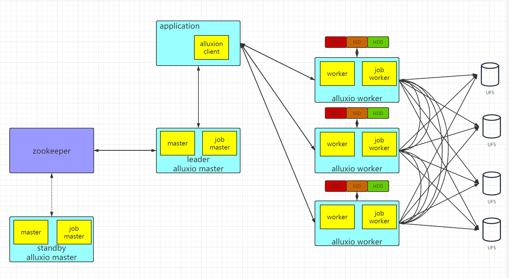
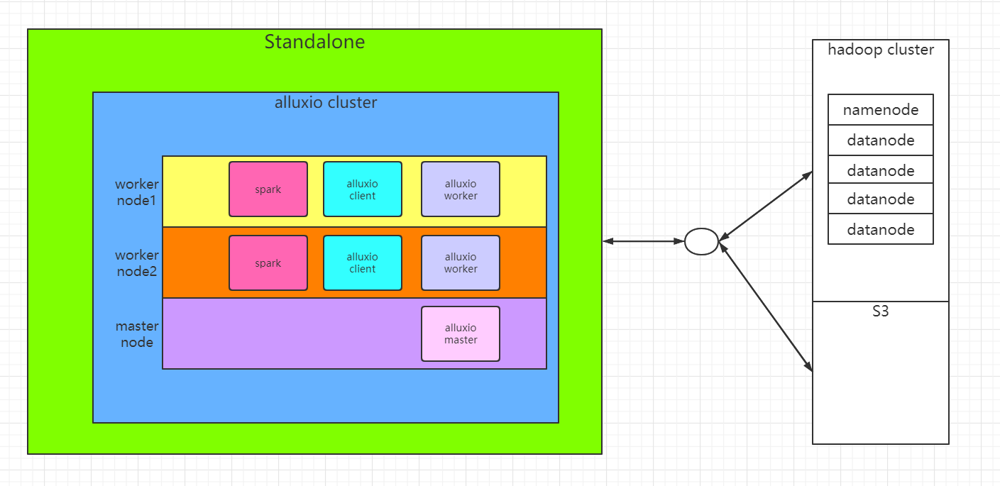
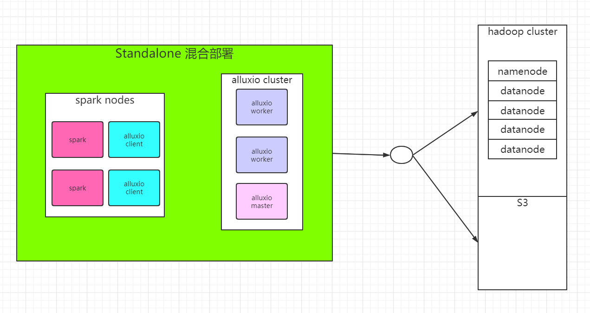
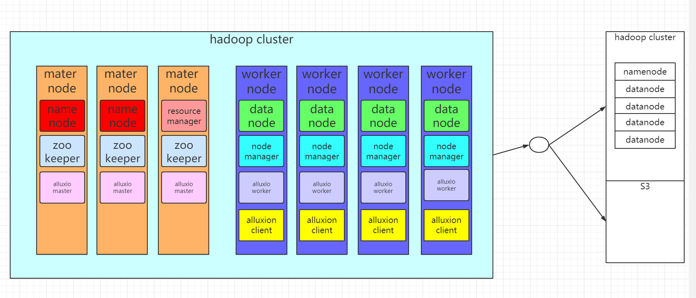

# 系统架构
**架构图**

# 部署模式
## Standalone co-locate模式

## Standalone 混合模式

## 基于yarn模式

## 配置
**配置alluxio-site.properties**
```
    cp conf/alluxio-site.properties.template conf/alluxio-site.properties
```
> * alluxio.master.hostname 设置alluxio的master节点
        
> * alluxio.master.mount.table.root.ufs=${alluxio.work.dir}/underFSStorage 设置alluxio底层存储为本地文件系统上的一个目录${alluxio.work.dir}/underFSStorage，这样持久化的数据会被存储在这个目录下。这种配置底层存储系统为本地文件系统的方式只有单机模式的时候才有意义。

**配置jdk**

    编辑alluxio-env.sh文件
    export JAVA_HOME=/PATH...

**配置master**

    echo "$MasterIP">conf/master
**配置worker**

    echo "$WorkerIP">conf/master
**格式化**
```bash
    [root@node1 alluxio]# bin/alluxio format
```
**启动**
```bash
    [root@node1 alluxio]# bin/alluxio-start.sh local
```
**测试**
```bash
    [root@node1 alluxio]# bin/alluxio runTests
    //若程序正确运行，应该能看到类似下面的输出结果
    Passed the test!
```
**停止**
```bash
    [root@node1 alluxio]# bin/alluxio-stop.sh local
```
# 常见问题
* Failed to format

*报错日志*
```java
    java.nio.file.NoSuchFileException: /mnt/ramdisk/alluxioworker
```
*解决方法*
```java
    ./bin/alluxio-mount.sh SudoMount workers
    or 
    mount -t ramfs -o -size=1G ramfs /mnt/ramdisk
```
* ramfs is smaller than the configured size
*报错日志*
```java
    IllegalStateException: ramfs is smaller than the configured size: ramfs size: 10.45GB, configured size: 20.95GB
```
*解决方法*
```shell
    alluxio.worker.tieredstore.level0.dirs.quota=10GB
```