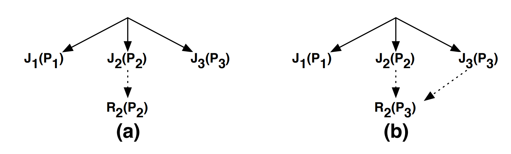
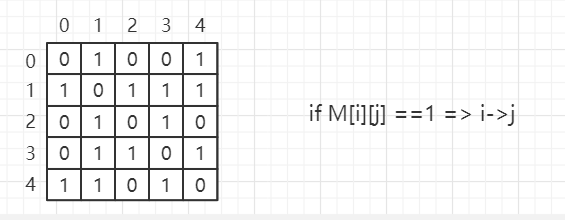
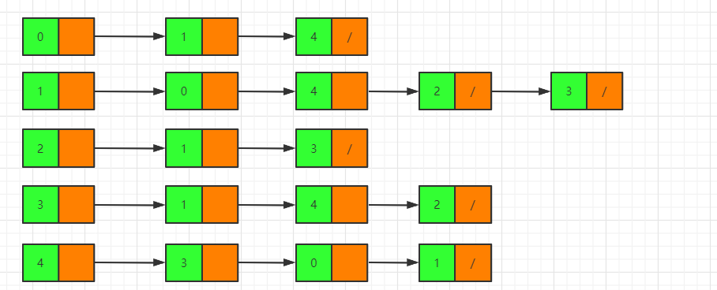

# 当前公司一般使用多种存储系统和计算框架，面临以下问题：
* 数据共享与管理

    计算框架和应用程序使用多种存储系统造成的数据孤岛使得数据共享和数据管理非常困难
* 性能

    大多数存储系统是部署在远程计算机系统上的，因此网络和磁盘IO成了性能瓶颈

* 灵活性

    一旦更换了存储系统，现有的应用程序可能就不能正常工作了，需要重新开发。
* 工作重复

    每个存储系统需要实现相似的API
* 数据重复

# VDFS
* Southbound APIs (SAPIs)

    和不同的存储系统交互
* Northbound APIs (NAPIs) 

    使应用程序不用任何修改就可以访问共享数据

*  简化管理和操作
> * 解耦计算和存储。应用程序只需要和VDFS交互，不需要和底层各种存储系统交互

* 性能：最高能提升两个数量级
> * 将热数据保存在高性能存储系统上
> * 将冷数据保存在较低性能的存储系统上

* 支持计算框架：
    Spark Presto Tensorflow MapReduce HBase Hive Kafka Flink
* 支持存储系统
     S3， GCS， MAS， OpenStack Swift， GlusterFS，HDFS，MaprFS，Ceph，NFS，Alibaba OSS，EMC ECS，IBM Cleversafe

* NAPI examples
    Hadoop， S3 / Swift， FUSE， REST
* SAPI examples
    Filesystem ，Object Storage
* 部署模式
    单机模式，k8s，Mesos，DCOS，Yarn
* 部署在本地，公有云，混合云

* 关键技术
    Lineage，DFS-Perf

* Lineage
    以某种方式基于血统关系图去checkpoint数据可以限制数据恢复的时间
    在后台异步的 checkpointing files。边缘计算（Edge algorithm）算法选择何时、何文件

* 如何分配用于重新计算的资源
    优先级、加权公平

* 属性
    * 数据不可变
    * 确定性工作
    * 本地计算
    * 内存存储
    * 移动计算
* 目前
    spark虽然是基于内存计算的，但是job之间的数据共享无法做到，需要先落盘才行
* 写性能
    磁盘IO，网络IO 

media|capacity|bandwith|
-|-|-|
HDD (x12)|12-36 TB|0.2-2 GB/sec
SDD (x4)| 1-4 TB |1-4 GB/sec
Network |N/A |1.25 GB/sec
Memory| 128-512 GB| 10-100 GB/sec

* 复制问题
    现在的存储系统为了容错，通常存储多个副本。

# 设计概览
## 系统架构

* In addition to managing metadata, the master also contains a workflow manager. The role of this manager is to track lineage information, compute checkpoint order (§2.4), and interact with a cluster resource manager to allocate resources for recomputation (§2.5)
* Each worker runs a daemon that manages local resources, and periodically reports the status to the master. In addition, each worker uses a RAMdisk for storing memory-mapped files. A user application can bypass the daemon and interact directly with RAMdisk. This way, an application with data locality §2.2.1 can interact with data at memory speeds, while avoiding any extra data copying

### 资源分配策略
#### 1.基于优先级的调度策略
> 集群中有三个任务：j1,j2,j3.任务的优先级依次递增。有两个文件F1,F2需要恢复，恢复任务分别是R1,R2。

如果所有的恢复任务的优先级都是最低的，则可能会导致优先级错乱的问题。比如，R2的优先级低于J2,当J2占用所有资源时，R2无法获取资源为J2提供所需要的F2,此时会发生死锁的问题。通过优先级集成的方法可以解决此问题。当J2需要F2时，提高R2的优先级到P2。如果后续J3需要F2，则提高R2的优先级到P3

#### 2.公平调度算法

# 深度优先算法
## 图（graph）
* 有向图
    有向图中的相连线是有方向的
    * 有向图的实现（矩阵）

    

    缺点：空间复杂度比较高，因为有没有连线都需要记录，所以会记录很多无用的数据
    * 有向图的实现（链表）

     

* 无向图
    在无向图中，每个顶点和其他顶点通过相连线连接
* 权重图
    权重图中，每条相连线有各自的权重
## 有向图的实现
## 图的遍历

write|read|sw|
-|-| -|
15GB/sec/node |38GB/sec/node |Alluxio
0.14GB/sec/node|17 GB/sec/node|MemHDFS

