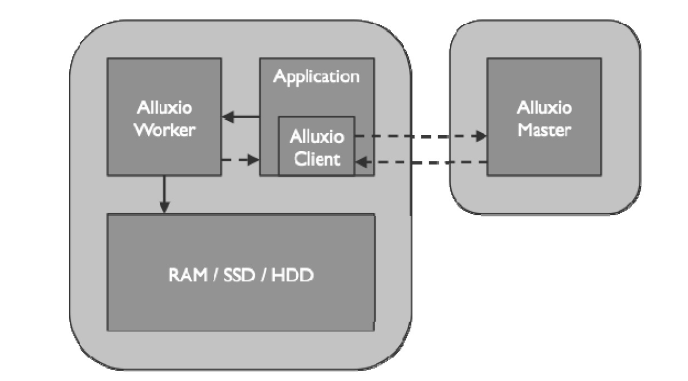
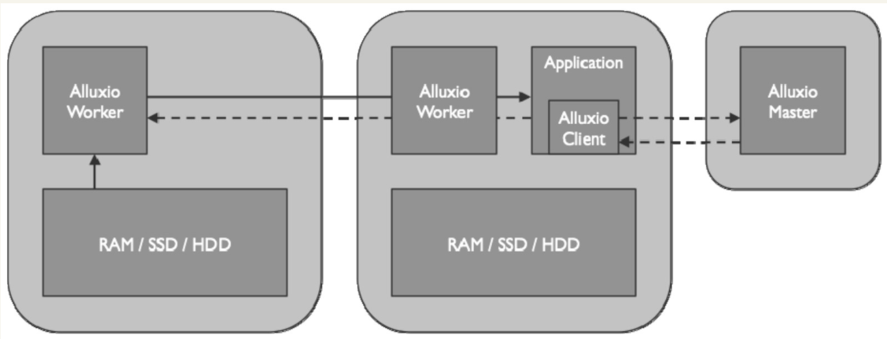

# alluxio读场景数据流
> alluxio可以作为用户的应用程序，利用client从底层存储系统读取数据的读缓存，本文介绍不同的缓存场景对其性能的影响。

## 从本地worker中读取数据
*当一个应用程序需要读取的数据已经被缓存在本地alluxio worker上，如图所示：*

**具体流程：**

    alluxio client会向alluxio master检索存储该数据的alluxio worker的位置，如果发现本地alluxio worker存有该数据，alluxio client将绕过alluxio worker直接通过本地文件系统读取数据文件。
    默认情况下，此种读取数据的方式，又称为短路读，需要获得响应的本地文件系统操作权限。
## 从远程worker中读取数据
*当被alluxio client请求的数据不在本地alluxio worker中，如图所示：*

**具体流程**
    alluxio client会向alluxio master检索存储该数据的alluxio worker的位置，如果发现本地alluxio worker未存储该数据，则将从远程worker节点读取数据，client将通过RPC连接远程worker请求数据，通过网络读取数据。
    默认情况下，worker除了将数据返回到客户端，还将在本地写入一个副本以便将来可以从本地读取数据。因此，被请求的数据越多，就会有越多的副本，从而实现了根据数据热度优化计算的本地性。用户可以指定NO_CACHE的读取方式来禁用本地副本的写入功能。
## 未命中worker的情况
    如果请求的数据没有被缓存在alluxio中，则应用程序将必须从底层存储中读取数据。alluxio client将读请求委托给worker，从底层存储中读取数据，worker同时将数据缓存以便将来读取。
    在缓存没有命中的情况下，Alluxio客户端会（通过worker）去底层存储系统读取一个完整的数据块，将其缓存至Alluxio，然后把所需数据返回给应用程序。然而，对于很多SQL类型的作业，客户端常常只需要读取Parquet文件的表尾（不超过10MB），但第一次请求 Alluxio 时，Alluxio 会尝试读取并缓存一个完整的数据块，以便于响应未来的请求。Alluxio v1.7开始实现了优化的异步数据缓存操作。client不再同时负责数据的读取和缓存，而是将缓存操作交给Alluxio Worker节点。worker端的缓存操作同客户端的读操作异步进行。这一改进极大地简化了 client 读取数据的过程，并且由于不需要等待缓存操作完成即可返回应用程序结果，从而能够显著地提高某些类型作业的性能。
### 异步缓存策略
    异步缓存将缓存操作的开销由客户端转移到 worker。客户端读数据的同时，缓存数据块任务由worker在后台异步处理（除非用户指定读取类型为"NO_CACHE"）。不论是读取完整或部分数据块，缓存操作对 client 性能均没有额外的影响。
    如果客户端使用的读取类型为"CACHE"，且从头到尾顺序地从底层存储读取一个完整数据块，那么worker在帮助客户端读取底层存储系统的过程中即积累了完整的数据。
    如果worker发现client只是读取数据块的一部分而非整体，或者正在以非顺序的方式读取数据块内部数据，那么worker便会放弃在读取的时候顺便缓存。而客户端则会在读取完成后向worker节点发送异步缓存命令并继续。之后，worker节点再从底层存储获取完整的块。
### 调整和配置异步缓存策略
    每个worker节点有一个线程池，其大小由参数“alluxio.worker.network.netty.async.cache.manager.threads.max”指定。调高此值可以加快后台异步缓存的速度，但CPU使用率会增加。降低该值则会减慢异步缓存的速度，但也释放了CPU资源。

# 读取方式
## CACHE_PROMOTE（默认）
* 数据在alluxio中 ：移动到最高处存储
* 数据不在alluxio中：从UFS中读取数据并将数据写入到最高处存储
## CACHE
* 数据在alluxio中 ：直接读取
* 数据不在alluxio中：从UFS中读取数据并将数据写入到最高处存储
## NO_CACHE
* 数据直接从UFS中读取数据，不写入alluxio中

