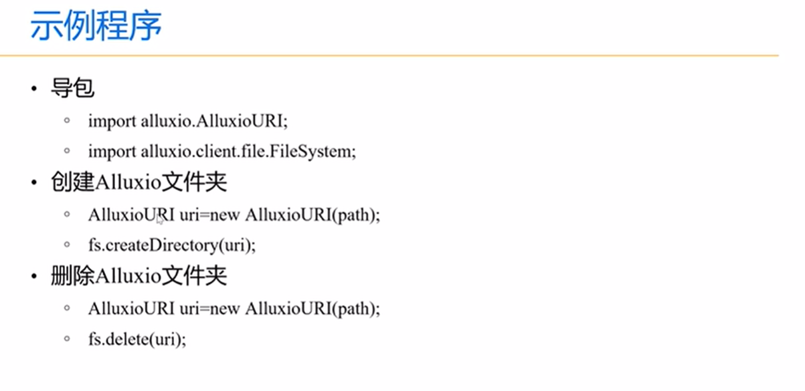
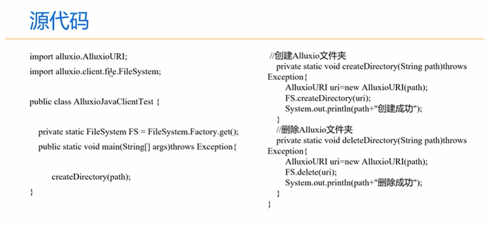

# 配置项管理
## 通用配置
配置项|默认值
-|-|
alluxio.debug|false
alluxio.logs.dir|${ALLUXIO_HOME}/logs
alluxio.logserver.logs.dir|${ALLUXIO_HOME}/logs
alluxio.logserver.port|45600
alluxio.job.master.rpc.port|20001
alluxio.job.worker.rpc.port|30001
## 主节点配置
配置项|默认值|说明
-|-|-|
alluxio.master.embedded.journal.port|19200|主节点选举通信端口
alluxio.master.metastore|HEAP|元数据存储方式
alluxio.master.metastore.dir|${ALLUXIO_HOME}/metastore|元数据存储位置
alluxio.master.mount.table.root.ufs|${ALLUXIO_HOME}/underFSStorage|根目录挂载位置
alluxio.master.mount.table.root.readonly|false|
alluxio.master.rpc.port|19998
alluxio.master.tieredstore.global.level0.alias|MEM
alluxio.master.tieredstore.global.level1.alias|SSD
alluxio.master.tieredstore.global.level2.alias|HDD
## 工作节点配置
配置项|默认值|说明
-|-|-|
alluxio.worker.memory.size|整个系统的2/3，或者1GB
alluxio.worker.tieredstore.level0.alias|MEM
alluxio.worker.tieredstore.level0.dir.path|/mnt/ramdisk
alluxio.worker.web.port|30000
alluxio.worker.tieredstore.level0.watermark.high.ratio|0.95
alluxio.worker.tieredstore.level0.watermark.low.ratio|0.7
## 用户配置
配置项|默认值|说明
-|-|-|
alluxio.user.block.size.bytes.default|64MB
alluxio.user.file.buffer.bytes|8MB
## 资源管理配置
配置项|默认值|说明
-|-|-|
alluxio.integration.master.resource.cpu|1
alluxio.integration.master.resource.mem|1GB
alluxio.integration.worker.resource.cpu|1
alluxio.integration.worker.resource.mem|1GB
## 安全配置
配置项|默认值|说明
-|-|-|
alluxio.security.authentication.type|SIMPLE
alluxio.security.authorization.permission.enabled|true
alluxio.security.authorization.permission.supergroup|supergroup
# 客户端的使用
## JAVA客户端的使用
* pom依赖
```java
    <dependencies>
        <dependency>
            <groupId>org.alluxio</groupId>
            <artifactId>alluxio-core-client-fs</artifactId>
            <version>2.6.0</version>
        </dependency>
    </dependencies>
```
**注意：在开发时，需要在当前用户的根目录下新建一个.alluxio目录，然后将集群配置文件alluxio-site.properties文件放进去**
* 示例：


# 集群的高可用
**主要挑战：更换leader时，数据同步问题，alluxio2.0版本提供两中方案**

* 使用基于内部RAFT的内部复制状态机来存储文件系统日志并选择一个主要主机。这种方法在alluxio2.0版本引入，不需要依赖外部服务
* 利用zookeeper服务选举leader，并利用共享存储（例如根UFS）进行日志共享

## 配置alluxio-site.properties文件
配置项|值|说明
-|-|-|
alluxio.master.hostname|node1|主节点域名
alluxio.master.mount.table.root.ufs|hdfs://node1:9000/alluxio|alluxio根路径
alluxio.zookeeper.enabled|true|使用zookeeper选举
alluxio.zookeeper.address|zk01:2181,zk02:2181,zk03:2181|zookeeper地址
alluxio.master.journal.type|UFS|指定日志类型
alluxio.master.journal.folder|hdfs://node1:9000/alluxio/journal|指定日志路径
alluxio.master.embedded.journal.address|node2:19200,node3:19200|leader选举端口
alluxio.worker.memory.size| 32GB|worker节点内存大小
## 格式化
    略
## 启动
    略
## 查看master
    bin/alluxio fs leader

