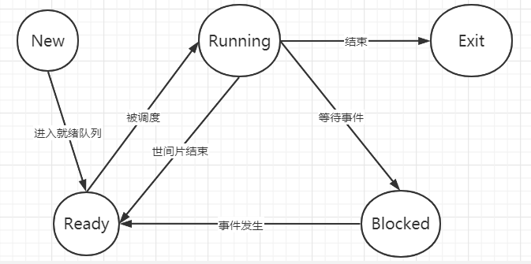
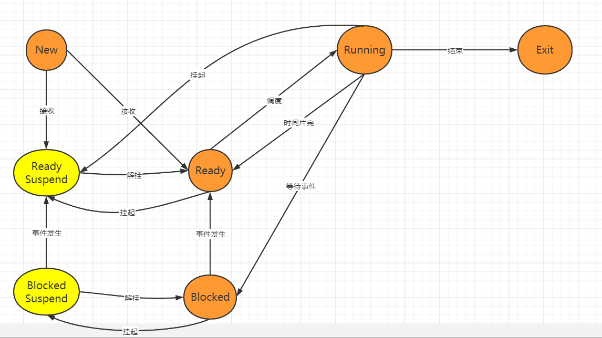
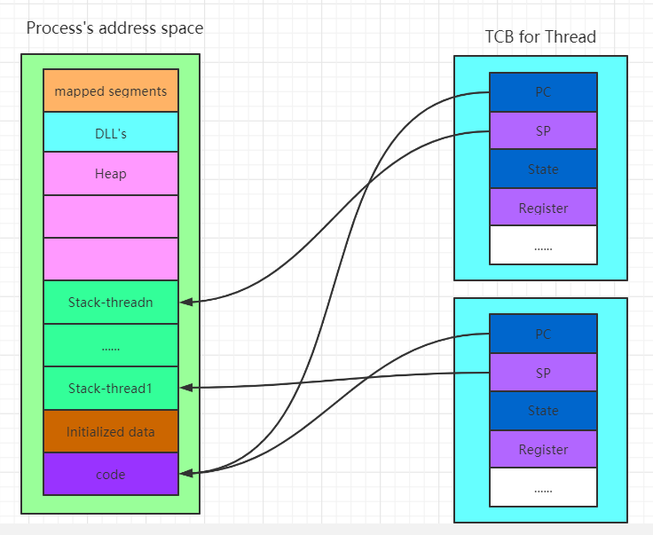
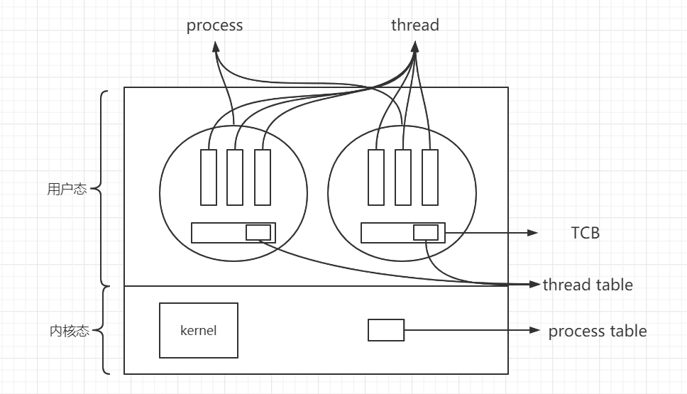

# 简介
* 从用户角度出发，操作系统是一个控制软件
* 管理应用程序
* 为应用程序提供服务
* 资源管理
* 管理外设、分配资源...

**操作系统实例**
```
    unix
    linux
    windows
```
**发展历史**
```
    1.早期计算机利用纸带传输程序和数据，操作系统只起到加载的作用
    2.成批/离线处理
    3.并发重用CPU，多道
    4.分时系统
    5.个人计算机
    6.分布式操作系统
    7.松、紧耦合系统
```
**启动**
```
    DISK:存放OS
    BIOS：基本I/O处理系统
    Bootloader：加载OS
    
```
**中断**

**系统调用**

**内存管理**

**进程及线程**
> 进程：一个具有一定独利功能的程序在一个数据集合上的一次动态执行过程

* 进程的组成
    * 程序的代码
    * 程序处理的数据
    * 程序计数器中的值，指示下一条将运行的指令
    * 一组通用的寄存器的当前值，堆、栈
    * 一组系统资源
* 进程和程序的关系
    * 程序是产生进程的基础
    * 程序每次与逆行构成不同的进程
    * 进程是程序功能的体现
    * 通过多次执行，一个程序可对应多个进程，通过调用关系，一个进程可以包括多个程序
* 进程和程序的区别
    * 进程是动态的，程序是静态的。程序是有序代码的集合，进程是程序的执行，进程有内核态和用户态。
    * 进程是暂时的，程序是永久的。进程是一个状态变化的过程，程序可以永久保存。
    * 进程与程序的组成不同。进程的组成包括程序，数据，进程控制块
* 进程的特点
    * 动态性
    * 并发性
    * 独立性
    * 制约性

*描述进程的数据结构：进程控制块*
* 进程控制块

    操作系统管理控制进程运行所有的信息集合。操作系统用PCB来描述进程的基本情况以及运行变化的过程，PCB是进程存在的唯一标志。

    * 进程的创建：为该进程创建一个PCB
    * 进程的终止：回收该进程的PCB
    * 进程的组织管理：通过对PCB的组织管理来实现
* PCB含有三大信息
    * 进程标识信息

        如本进程的标识，本进程的产生者标识，用户标识
    * 处理机状态信息保存区：保存进程的运行现场信息
        * 用户可见寄存器：用户程序可以使用的数据，地址等寄存器
        * 控制和状态寄存器：程序计数器，程序状态字等
        * 栈指针：过程调用/系统调用/中断处理和返回时需要用到它
    * 调度和状态信息： 用于操作系统调度进程并占用处理机使用
    * 进程间通信信息：为支持进程间的与通信相关的各种标识
    * 存储管理信息：包含有指向本进程映像存储空间的数据结构
    * 进程所用资源：说明由进程打开、使用的系统资源
    * 有关数据结构连接信息：进程可以连接到一个进程队列中，或连接到相关的其他进程的PCB
* PCB的组织方式
    * 链表
    * 索引表
* 进程管理
    * 进程的生命周期管理
        * 创建

            引起进程创建的3个主要事件：
            
                * 系统初始化时
                * 用户请求创建一个新进程
                * 正在运行的进程执行了创建进程的系统调用
        * 运行

            内核选择一个就绪的进程，让它占用处理机并执行

                * 为何选择
                * 如何选择
        * 等待

            在以下情况下，进程等待：

                * 请求并等待系统服务，无法马上完成
                * 启动某种操作，无法马上完成
                * 需要的数据没有到达
            此时进程只能自己阻塞自己，因为只有进程自身才能知道何时需要等待某种事件的发生。
        * 唤醒

            唤醒进程的原因：

                * 被阻塞的进程需要的资源可以被满足
                * 被阻塞的进程等待的事件到达
                * 将该进程的PCB插入到就绪的队列
            进程只能被别的进程或者操作系统唤醒
        * 结束

            在以下四种情形下，进程结束：

                * 正常退出
                * 错误退出
                * 致命错误
                * 被其他进程所杀
* 进程状态变化模型

    进程的三种基本状态：
    进程在生命结束之前处于且仅处于三种基本状态之一，不同系统设置的进程状态数目不同。

    * 运行状态：进程在处理机上运行
    * 就绪状态：一个进程获得了除处理机外的一切资源，一旦得到处理机即可运行
    * 等待状态：进程正在等待某一事件而暂停运行。



* 进程挂起

    why? 合理且充分利用系统资源
    进程在挂起状态时，意味着进程没有占用内存空间，处在挂起状态的进程映像在磁盘上。



    挂起状态：
        * 阻塞挂起状态：进程在外存并等待某事件的出现
        * 就绪挂起状态：进程在外存，但只要进入内存即可执行
    把一个进程从内存转到外存，可能有以下几种情况：
        * 阻塞到阻塞挂起：没有进程处于就绪状态或就绪进程要求更多内存资源时，会进行这种转换，以提交新进程或运行就绪进程。
        * 就绪到就绪挂起：当有高优先级阻塞进程（系统认为很快就绪的）和低优先级就绪进程时，系统会选择挂起低优先级就绪进程。
        * 运行到就绪挂起：对抢先式分时系统，当有高优先级阻塞挂起进程因事件出现而进入就绪挂起状态时，系统可能会把运行进程转到就绪挂起状态
    在外存时的状态转换：
        * 阻塞挂起到就绪挂起：当有阻塞挂起的进程因相关事件出现时，系统会把阻塞挂起进程转换未就绪挂起进程
    与挂起相关的状态转换：
        解挂/激活：把一个进程从外存转到内存，可能会有以下几种情况：
            * 就绪挂起到就绪：没有就绪进程或者挂起就绪进程优先级高于就绪进程时，发生这种转换。
            * 阻塞挂起到阻塞：当一个进程释放足够内存时，系统会把一个高优先级阻塞挂起进程转换为阻塞进程
* 线程管理
    * 什么是线程：进程当中的一条执行流程
        * 资源组合：构成了一个资源平台，包括地址空间（代码段、数据段），打开的文件等各种资源
        * 运行角度：代码在这个资源平台上的一条执行流程
    * 线程的优点：
        * 一个进程中可以同时存在多个线程
        * 各个线程之间可以并发执行
        * 各个线程之间可以共享地址空间和文件等资源
    * 线程的缺点
        * 一个线程崩溃，会导致其所属进程的所有线程崩溃
* 线程和进程的比较
    * 进程是资源分配单位，线程是CPU调度单位
    * 进程拥有一个完整的资源平台，线程只独享必不可少的资源，如寄存器和栈
    * 线程同样具有就绪、阻塞和执行三种基本状态，同样具有状态之间的转换关系
    * 线程能够减少并发执行的时间和空间开销：
        * 线程的创建时间比进程短
        * 线程的终止比进程快
        * 同一进程内的线程切换时间比进程短
        * 由于同一进程的各线程间共享内存和文件资源，可直接进行不通过内核的通信

* 线程的实现
    * 用户线程和内核线程的对应关系
        * 多对一
        * 一对一
        * 多对多
    

    * 用户线程

        * 用户线程的缺点
            * 阻塞性的系统调用如何实现？如果一个线程所发起的系统调用发生阻塞，则整个进程在等待
            * 当一个线程开始运行后，除非它主动的交出CPU使用权，否则它所在的进程当中其他线程无法运行。
            * 由于时间分片给进程，故与其他进程相比，在多线程执行时，每个线程得到的时间片较少，执行较慢。
* 上下文切换
    

**调度**

**同步互斥**

**文件系统**

**I/O**