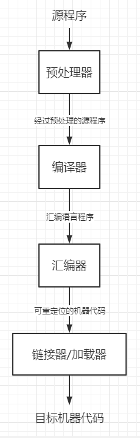

# 计算机程序设计语言及编译
*机器语言*

    可以被计算机直接理解。例如：C706 0000 0002（操作码，操作数1，操作数2）
*汇编语言*

    引入了助记符。例如：MOV X,2。依赖特定的机器。
*高级语言*

    例如：x=2,不依赖于特定的机器。
**将汇编语言转换成机器语言的过程称为汇编，将高级语言转换成机器语言或者汇编语言的过程称为编译。**

# 编译器在语言处理系统的位置

*预处理器：*

    * 把存储在不同文件中的源程序聚合在一起
    * 把被称为宏的缩写语句转换为原始语句
*可重定位：*

    在内存中存放的起始位置不是固定的

*加载器*

    修改可重定位地址，将修改后的指令和数据放到内存中适当的位置

**起始位置+相对地址=绝对地址**

*链接器*

    * 将多个可重定位的机器代码连接到一起
    * 解决外部内存地址（一个文件可能会引用另一个文件）问题

