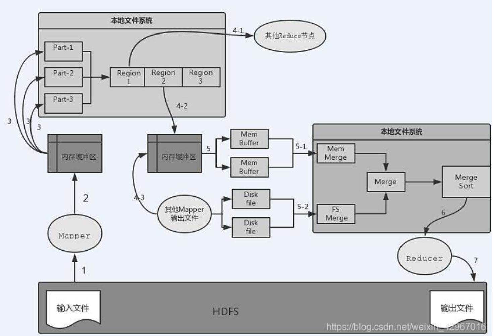
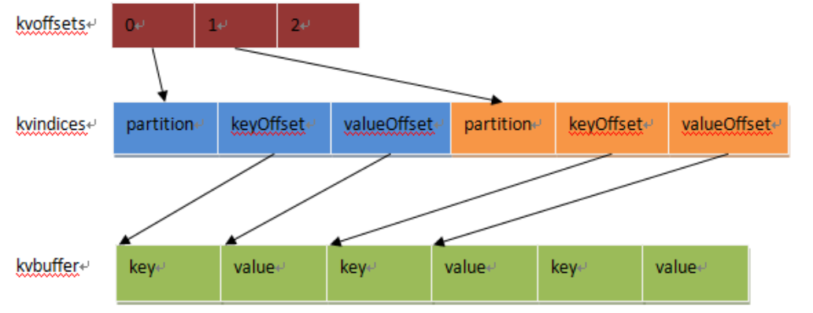

# HDFS --> Mapper

# Mapper --> 内存缓冲区
    Mapper的输出并不是直接写入本地文件系统，而是先写入内存缓冲区
# 内存缓冲区 --> 本地磁盘
    当缓冲区达到一定的阈值时就将缓冲区中的数据以临时文件的形式写入本地磁盘。默认的缓冲区大小是100MB，溢写比例默认是0.8 (可通过spill.percent参数来调节)
    当达到阈值时，溢写线程就会启动并锁定这80MB内存执行溢写过程，这一过程称为spill。溢写线程启动的同时还会对这80MB的内存数据依据key的序列化字节做排序。当整个map任务结束后，会对这个map任务产生的所有临时文件进行合并，并产生最终的输出文件。
    需要注意：在写入内存缓冲区的同时执行Partition分区
    如果用户作业设置了Combiner，那么在溢写到磁盘之前会对Map输出的键值对调用Combiner归约，这样可以减少溢写到本地磁盘文件的数据量
# Mapper端本地文件 --> Reduce

# MapTask
##  Read阶段
    通过RecordReader对象，对HDFS上的文件进行split切分，输出<key,value>键值对

## Map阶段
    对输入的键值对调用用户编写的Map函数进行处理，输出<key,value>键值对

## Collector和Partitioner阶段
    收集Mapper输出，在OutputCollector函数内部对键值对进行Partitioner分区，以便确定相应的Reducer处理，这个阶段将最终的键值对集合输出到内存缓冲区。

## Spill阶段
    包含Sort和Combiner阶段，当内存缓冲区达到阈值后写入本地磁盘，在这个阶段会对Mapper的输出键值对进行排序，如果设置了Combiner会执行Combiner函数。
    
## Merge阶段
    对Spill阶段在本地磁盘生成的小文件进行多次合并，最终生成一个大文件。

**内存缓冲区**

# ReduceTask
## Shuffle阶段
    这个阶段就是Reduce中的Copy阶段，运行Reducer的TaskTracker需要从各个Mapper节点远程复制属于自己处理的一段数据。
## Merge阶段
    由于执行Shuffle阶段时会从各个Mapper节点复制很多同一partition段的数据，因此需要进行多次合并，以防止ReduceTask节点上内存使用过多或小文件过多
## Sort阶段
    虽然每个Mapper的输出是按照key排序好的，但是经过Shuffle和Merge阶段后并不是统一有序的，因此还需要在Reduce端进行多轮归并排序。
## Reduce阶段
    Reduce的输入要求是按照key排序的，因此只有在Sort阶段执行完成之后才可以对数据调用用户编写的Reduce类进行归约处理。