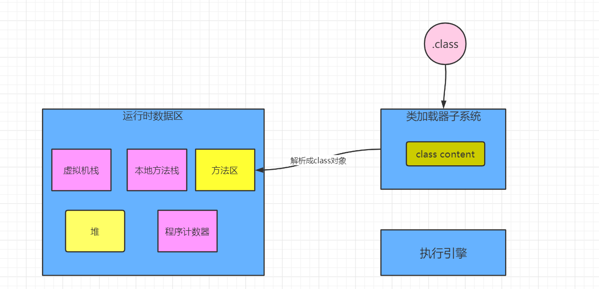
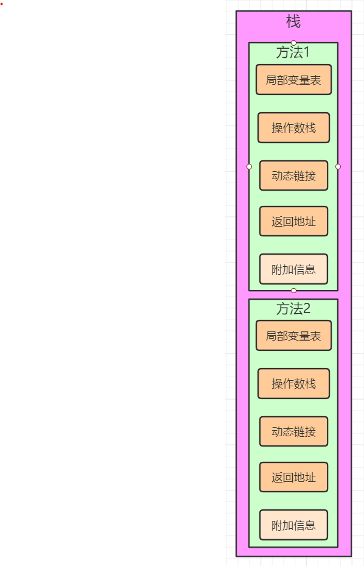
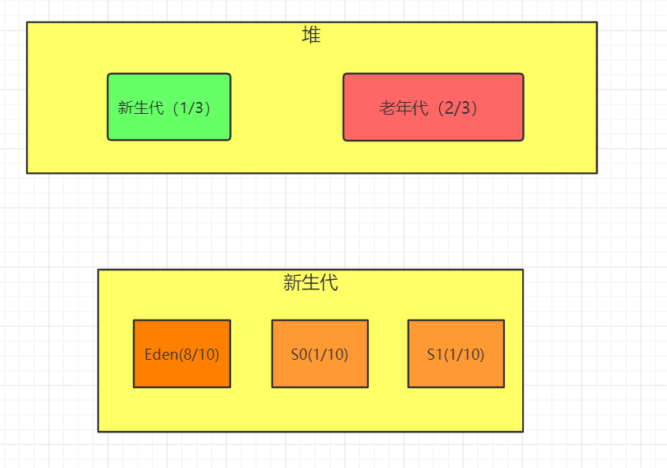

```
    synchronized +方法
    锁住的是this
    synchronized static + 方法
    隐式锁，锁住的是T.class

    工具：分析对象在内存中的布局
    jol-core 0.9:
    ClassLayout.parseInstance(o).toPrintable()


    对象在内存的布局有四部分：
    1.markword : 8 byte
    2.classpoint : 4/8 byte
    3.instalnceData : 
    4.pading : 补位的作用

    markword：
        1.锁信息


    纤程：用户态线程，轻量级线程
    线程管理：上下文切换（重量级操作，只有操作系统能做）
    重量级锁：需要通过操作系统进行线程切换
    轻量级锁：在用户态可以完成线程切换


    锁升级过程

```


```
    方法区，永久代，元空间
    永久代是放在堆上面的
    元空间是放在直接内存上的
    jdk8以后，元空间取代了永久代

    方法区是一种虚拟机规范，永久代和元空间是方法区的实现。

    32位系统：4G
    内核层：2G
    应用层：2G

    64位系统：8字节64位，除去16位保留位，还有48位，内存地址是2的48次方

    元空间默认大小是20+M，最大无限制
    内存抖动：元空间最大最小值设置一样可以避免，建议设置成物理内存的1/32

    虚拟机栈默认大小1M
    栈帧：
        局部变量表：形参，局部变量
        动态链接：方法的直接地址


    堆默认大小：
     最小：1/64 
     最大：1/4
    为什么要分新生代和老年代：

    老年代存放什么对象？
        1.大对象：对象的大小超过Eden区大小
        2.老对象：对象的年龄超过15
        3.空间分配担保
    新生代为什么分成3份？
```

# 内存池
## 操作系统分配内存流程
```
目前操作系统只有0，3环
R0：内核层
R3：用户态

物理地址：内存条映射成地址
线性地址：线性地址和物理地址之间有映射

GC算法：
    标记-清除：内存碎片
    标记-整理：
    标记-复制
    分代收集
    基于region的GC算法

标记-清除算法：
标记阶段
清除阶段

新生代的垃圾回收器基本上都是基于分代理论+复制算法，复制算法的底层有标记-清除算法的影子
老年代的垃圾回收器基本上是基于标记-整理算法。标记-整理算法的底层依然是标记-清除算法。

标记整理算法：
标记，整理，碎片合并，数据移动
```
## 内存池通用结构
## 内存池通用算法
# new的执行流程


# jvm内存模型

# jvm-栈模型

# jvm-堆模型
