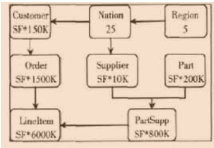

<h1><center>大数据安全防护-Kerberos</center></h1>

&emsp;&emsp;2020年IBM研究报告显示数据泄露事件给企业造成的平均成本为 386万美元，智能技术将数据泄露成本降低了一半。大数据作为企业转型升级的重要支撑性技术，在数据采集、加工、存储、聚合、交换、应用等诸多环节存在安全防护需求，数据安全程度将对企业转型升级的成败产生重大的影响。在大数据场景下，数据在生命周期的各个阶段都面临着安全风险，因此，大数据安全防护策略需着眼于数据的**全生命周期来进行安全管控**，保障数据在**存储、传输、使用、销毁等各个环节的安全**。目前，大数据安全防护技术依赖于传统的安全防护技术，虽然能够取得一定的效果，但还存在许多不足；和大数据安全相关的一些关键技术也在研究当中，已经取得了一定的进展。

* 数据加密技术：用某种特殊的算法改变原有的信息数据使其不可读或无意义。
  
  &emsp;&emsp;在大数据环境中，数据具有多源异构的特点，数据量大、类型多，若对所有数据制定同样的加密策略，则会大大降低数据的机密性和可用性。因此，在大数据环境下，需要先进行数据资产安全分类分级，然后对不同类型和安全等级的数据指定不同的加密要求和加密强度。
* **身份认证技术：验证被认证对象的属性来确认被认证对象是否真实有效，目的在于识别用户的合法性**

    * 基于被验证者所知道的信息，如口令、密码等
    * 基于被验证者所拥有的东西
    * 基于被验证者的生物特征

* 访问控制技术：对用户进行身份认证后，需要按用户身份及所属组来限制用户对某些信息项的访问，或限制用户对某些功能的使用
  * 强制访问控制
  * 自主访问控制
  * **基于角色的访问控制**
* 安全审计技术：对正常流程、异常状态和安全事件等进行记录和监管的安全控制手段，防止违反信息安全策略的情况发生，也可用于责任认定、性能调优和安全评估等目的
* 跟踪与取证技术：数据溯源技术
* 恢复与销毁技术：原始数据在丢失后进行恢复的功能，包括软恢复、硬恢复、大型数据库系统恢复、异性系统数据恢复和数据覆盖恢复等。
  * 软恢复：存储系统、操作系统或文件系统层次上的数据丢失
  * 硬恢复：硬件故障所造成的数据丢失，如磁盘电路板损坏、盘体损坏、磁道损坏、磁盘片损坏、硬盘内部系统区严重损坏等
  * 数据库系统恢复：冗余备份、日志记录文件、带有检查点的日志记录文件、镜像数据库等。
  * 数据覆盖恢复：只有硬盘厂商及少数几个国家的特殊部门能够做到，它的应用一般都与国家安全有关。
  * 异性系统数据恢复：不常用、比较少见的操作系统下的数据恢复，如MAC、OS2、嵌入式系统、手持系统、实时系统

**友商大数据平台关于安全的企业级增强：**

* 安全
  * 架构安全：基于开源组件实现功能增强，保持100%的开放性，不使用私有架构和组件。
  * 认证安全：
    * 基于用户和角色的认证统一体系，遵从帐户/角色**RBAC**（Role-Based Access Control）模型
    * 支持安全协议Kerberos，通过Kerberos对帐户信息进行安全**认证**。
    * 单点登录，对登录平台的用户进行**审计**
  * 文件系统层**加密**

&emsp;&emsp;综上所述，身份认证是大数据安全体系中重要的一环，Kerberos是一种网络认证协议，其设计目标是通过密钥系统为客户机/服务器应用程序提供强大的**身份认证服务**。该认证过程的实现**不依赖于主机操作系统的认证**，**无需基于主机地址的信任**，**不要求网络上所有主机的物理安全**，并假定网络上**传送的数据包可以被任意地读取、修改和插入数据**。在以上情况下， Kerberos 作为一种可信任的第三方认证服务，是通过传统的密码技术（如：共享密钥）执行认证服务的。

<div class="center">
    
</div>
<h5><center>Kerberos:希腊神话中的人物,是一条守护地狱之门的三头保卫神犬</center></h5>

<br/>
<br/>

<h2>概念</h2>

* Principal：Kerberos主体。主体是 KDC 可以为其分配票证的唯一标识，可以是用户或者服务，约定主体名称分为三个部分：主名称、实例和域名。

    <div class="indentation_1">

     principal|角色
     |:-:|:-:|
    |nm/sizu05@BIGDATA|服务|
    |nm/sizu06@BIGDATA|服务|
    |hbase-l3kerberos@BIGDATA|用户|
    |hdfs-l3kerberos@BIGDATA|用户|
    </div>

* keytab
  
  加密后的密码本，里面可以保存一个或者多个principal的密码。加密算法可以通过配置文件指定。

* krb5.conf：Kerberos客户端配置文件

    * default_realm：默认域名，如果配置了默认域名，principal后面没有带域名的时候会自动补上。
    * renew_lifetime：票据最大可更新时长。
    * ticket_lifetime：票据有效期。

* kdc.conf：Kerberos server的配置文件

    端口配置（默认88，749，464），日志文件存放路径，缓存路径等。

* KDC：密钥分发中心
* kerberos Server:kerberos服务端，包含认证服务器、密钥分发中心、票据授权服务器

<h2>认证原理</h2>

*部分流程：*

* 用户向认证服务器发送一条明文消息，申请访问服务。
* 认证服务器检查Kerberos数据库中是否有此用户，如果有则返回两条消息
  * A:Client/TGS会话密钥。通过用户密钥进行加密。
  * B:TGT，包含消息A、用户信息、有效期等信息。通过TGS密钥进行加密。
* 用户使用自己的用户密钥解密消息A，获得Client/TGS会话密钥。然后向票据授权服务器发送两条消息：
  * C:包含消息B和服务信息。通过TGS密钥进行加密。
  * D:认证符（Authenticator）,包括用户ID,时间戳等信息。通过Client/TGS会话密钥进行加密。
* 票据授权服务器检查Kerberos数据库中是否存在用户请求的服务，如果存在则用TGS密钥解密消息C从而获得消息B拿到用户信息、有效期、Client/TGS会话密钥等信息。然后可以顺利解密消息D获得Authenticator，通过对比消息B和Authenticator中的信息进行验证用户是否合法。如果合法则想客户端发送两条消息。
  * E：client-to-server票据，包含Client/SS会话密钥，用户信息，有效期等。通过服务密钥进行加密。
  * F：Client/SS会话密钥，通过Client/TGS会话密钥进行加密。
* 用户接收到消息后用Client/TGS会话密钥解密消息F，获取Client/SS会话密钥，然后可以开始服务请求。

<h2>集成</h2>

* Kerberos server组件集成

    InsightHD没有集成Kerberos server，需要使用外部Kerberos服务。所以目前集群开启Kerberos服务前需要先手动搭建一个Kerberos服务。开启keberos的流程实际上为每个节点安装Kerberos客户端并为集群内的服务集成Kerberos协议。

* 集群服务集成Kerberos协议

    服务集成Kerberos协议首先需要服务自身支持Kerberos协议。ambari在开启Kerberos服务时会根据kerberos.json文件创建principal及keytab文件。


    **以HDFS的namenode和datanode为例:**

    *namenode:*
    ```shell
        {
          "name": "NAMENODE",
          "identities": [
            {
              "name": "hdfs",
              "principal": {
                "value": "${hadoop-env/hdfs_user}${principal_suffix}@${realm}",
                "type" : "user" ,
                "configuration": "hadoop-env/hdfs_principal_name",
                "local_username" : "${hadoop-env/hdfs_user}"
              },
              "keytab": {
                "file": "${keytab_dir}/hdfs.headless.keytab",
                "owner": {
                  "name": "${hadoop-env/hdfs_user}",
                  "access": "r"
                },
                "group": {
                  "name": "${cluster-env/user_group}",
                  "access": ""
                },
                "configuration": "hadoop-env/hdfs_user_keytab"
              }
            },
            {
              "name": "namenode_nn",
              "principal": {
                "value": "nn/_HOST@${realm}",
                "type" : "service",
                "configuration": "hdfs-site/dfs.namenode.kerberos.principal",
                "local_username" : "${hadoop-env/hdfs_user}"
              },
              "keytab": {
                "file": "${keytab_dir}/nn.service.keytab",
                "owner": {
                  "name": "${hadoop-env/hdfs_user}",
                  "access": "r"
                },
                "group": {
                  "name": "${cluster-env/user_group}",
                  "access": ""
                },
                "configuration": "hdfs-site/dfs.namenode.keytab.file"
              }
            },
            {
              "name": "hdfs_namenode_spnego",
              "reference": "/spnego",
              "principal": {
                "configuration": "hdfs-site/dfs.namenode.kerberos.internal.spnego.principal"
              }
            },
            {
              "name": "hdfs_namenode_namenode_nn",
              "reference": "/HDFS/NAMENODE/namenode_nn",
              "principal": {
                "configuration": "ranger-hdfs-audit/xasecure.audit.jaas.Client.option.principal"
              },
              "keytab": {
                "configuration": "ranger-hdfs-audit/xasecure.audit.jaas.Client.option.keyTab"
              }
            }
          ],
          "configurations": [
            {
              "hdfs-site": {
                "dfs.block.access.token.enable": "true"
              }
            }
          ]
        }
    ```

    *datanode:*
    ```shell
        {
          "name": "DATANODE",
          "identities": [
            {
              "name": "datanode_dn",
              "principal": {
                "value": "dn/_HOST@${realm}",
                "type" : "service",
                "configuration": "hdfs-site/dfs.datanode.kerberos.principal",
                "local_username" : "${hadoop-env/hdfs_user}"
              },
              "keytab": {
                "file": "${keytab_dir}/dn.service.keytab",
                "owner": {
                  "name": "${hadoop-env/hdfs_user}",
                  "access": "r"
                },
                "group": {
                  "name": "${cluster-env/user_group}",
                  "access": ""
                },
                "configuration": "hdfs-site/dfs.datanode.keytab.file"
              }
            }
          ],
          "configurations" : [
            {
              "hdfs-site" : {
                "dfs.datanode.address" : "0.0.0.0:1019",
                "dfs.datanode.http.address": "0.0.0.0:1022",
                "dfs.data.transfer.protection": "authentication,privacy"
              }
            }
          ]
        }
    ```
  
<h2>使用</h2>

* Kerberos客户端的使用

    * 创建principal:addprinc -pw password princialName
    * 导出keytab文件:kadd -norandkey -kt keytabPath princialName
    * 查看所有的principal:listprincipal
    * ...

* 开启Kerberos后服务的访问
  * 创建一个用户
  * 为用户赋权
  * 开始访问

*&emsp;&emsp;错误示例：*

```
    FLUME -> KAFKA -> SPARK 
    FLUME的jaas文件中配置的是FLUME服务的pricipal.
    KAFKA的jaas文件中配置的是KAFKA服务的principal.
    SPARK中用的是Spark服务的principal.
```

*&emsp;&emsp;正确示例：*

```
    FLUME -> KAFKA -> SPARK 
    整个流程中使用一个用户principal，并给用户赋予KAFKA,HDFS，YARN等相应服务的访问权限。
```
<h2>关闭Kerberos</h2>
&emsp;&emsp;Ambari提供了近用Kerberos的按钮，但是实际使用过程中关闭流程出错的概率比较大，总是遇到数据库配置异常的提示,可以通过后台手动关闭Kerberos，但是各个服务还需要手动修改相应认证配置。

* 需要备份的表
  
  *  ambari.servicedesiredstate
  *  ambari.hostcomponentdesiredstate
  *  ambari.hostcomponentstate
  *  ambari.servicecomponentdesiredstate
  *  ambari.clusterservices
  *  ambari.clusters
  *  ambari.kkp_mapping_service
  *  ambari.kerberos_keytab_principal
  *  ambari.kerberos_principal
  *  ambari.kerberos_keytab
  *  ambari.clusterconfig

* 修改clusters表：页面上启动/禁用Kerberos

    `update ambari.clusters set security_type='NONE';`

    NONE:启用Kerberos按钮可用

    KERBEROS:禁用Kerberos按钮可用

* 删除服务列表中显示的Kerberos组件
  
  `delete from ambari.servicedesiredstate where service_name='KERBEROS';`

  `delete from ambari.hostcomponentdesiredstate where service_name='KERBEROS';`

  `delete from ambari.hostcomponentstate where service_name='KERBEROS';`

  `delete from ambari.servicecomponentdesiredstate where service_name='KERBEROS';`

  `delete from ambari.clusterservices where service_name='KERBEROS';`

* 禁用集群Kerberos配置
  
  *将ambari.clusterconfig表中type_name="cluster-env"的行中config_data字段中security_enabled的值由true 改为false*

* 重启ambari-server即可

<style>
    .indentation_1 {
    width: auto;
    display: table;
    margin-left: 1cm;
    margin-right: auto;
    }
    .indentation_2 {
    width: auto;
    display: table;
    margin-left: 1.5cm;
    margin-right: auto;
    }
    .indentation_3 {
    width: auto;
    display: table;
    margin-left: 3cm;
    margin-right: auto;
    }
    .center {
    width: auto;
    display: table;
    margin-left: auto;
    margin-right: auto;
    }
</style>

