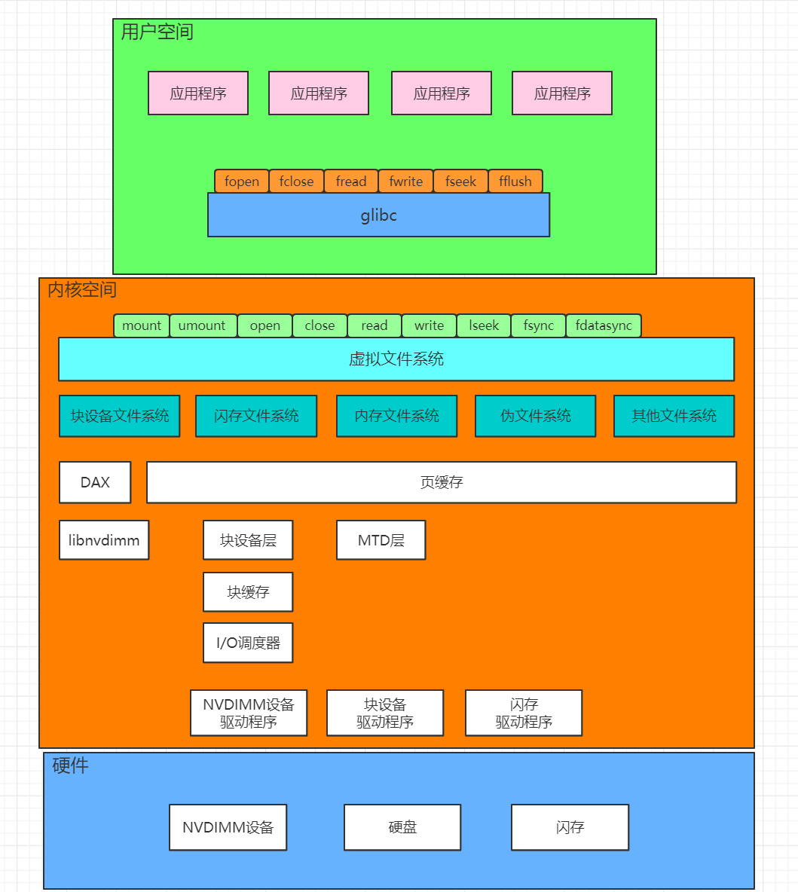

**linux文件系统架构图**


# 用户空间
*应用程序可以直接使用内核提供的系统调用访问文件：*

* 一个存储设备上的文件系统，只有挂载到内存中目录树的某个目录下，进程才能访问这个文件系统。系统调用mount用来把文件系统挂载到内存中目录树的某个目录下。可以执行：`mount -t fstype device dir`,把文件系统挂载到某个目录下，mount命令调用系统调用mount来挂载文件系统。
* 系统调用umount用来卸载某个目录下挂载的文件系统，可以执行`umount dir`来卸载文件系统，umount调用系统调用umount
* 使用open打开文件
* 使用close关闭文件
* 使用read读文件
* 使用write写文件
* 使用lseek设置文件偏移
* 当我们写文件时，内核的文件系统模块把数据保存在页缓存中，不会立即写到存储设备，我们可以使用fsync把文件修改过的属性和数据立即写到存储设备，或者使用fdatasync把文件修改过的数据立即写到存储设备上。应用程序页可以使用glibc库封装的标准I/O流函数访问文件，标准I/O流提供了缓冲区，目的是尽可能减少read/write的调用次数，提高性能。
* glibc库封装的标准I/O流函数：
    * fopen：打开流
    * fclose：关闭流
    * fread：读流
    * fwrite：写流
    * fseek：设置文件偏移
    * 使用fwrite可以把数据写到用户空间缓存区，但是不会立即写到内核。我们可以使用fflush立即把数据立即从用户空间缓存区写到内核中。

# 硬件
## 块设备
* 机械硬盘

    机械硬盘的读写单位是扇区。访问机械硬盘的时候，需要首先沿着半径方向移动磁头寻找磁道，然后转动盘片找到扇区。
* 闪存类设备

    使用闪存作为存储介质，里面的控制器运行固化的驱动程序，驱动程序的功能之一是闪存转换层，把闪存转换为块设备，对外表现为块设备。
## 闪存

## NVDIMM
    非易失性内存
# 内核
    为了对用户程序提供统一的文件操作接口，为了使不同的文件系统实现共存，内核实现了一个抽象层，成为虚拟文件系统。
## 块设备文件系统
    存储设备是机械硬盘或固态硬盘等块设备
## 闪存文件系统
    存储设备是闪存设备
## 内存文件系统
    文件在内存中，断电以后文件丢失，常用的内存文件系统时tmpfs,用来创建临时文件
## 伪文件系统
* sockfs

    这种文件系统是的套接字可以使用读文件的接口read接收报文，使用写文件的接口write发送报文
* proc

    开发proc文件系统的目的是把内核中的进程信息导出到用户空间，后来扩展到把内核中的任何信息导出到用户空间，通常把proc文件系统挂载到/proc目录下
* sysfs

    用来把内核的设备信息导出到用户空间
* hugetlbfs

    用来实现标准巨型页
* cgroup

    用来控制一组进程的资源，使管理员可以使用写文件的方式配置cgroup
* cgroup2

*访问外部存储设备的速度很慢，为了避免每次读写文件时访问外部存储设备，文件系统模块为每个文件在内存中创建了一个缓存，缓存的单位为页*

*块设备的访问单位是块，块的大小是扇区大小的整数倍。内核为所有的块设备实现了统一的块设备层。为了避免每次读写都需要访问块设备，内核实现了块缓存，为每个块在内存中创建一个块缓存，缓存的单位为块，块缓存基于页缓存实现。*

# 虚拟文件系统的数据结构
## 超级块
    文件系统的第一块是超级块，描述文件系统的总体信息，挂载文件系统的时候在内存中创建超级块的副本，结构体是super_block.
```c
    struct super_block{
        struct list_head s_list;
        dev_t s_dev;
        unsigned char s_blocksize_bits;
        unsigned long s_blocksize;
        loff_t s_maxbytes;
        struct file_system_type *s_type;
        const struct super_operations *s_op;
        ...
        unsigned long s_flags;
        unsigned long s_iflags;
        unsigned long s_magic;
        struct dentry *s_root;
        ...
    }
```