# 基本概念
**主键**
>唯一标识表中每行的这个列（或这组列）称为主键。主键用来表示一个特定的行.没有主键，更新或删除表中特定行很困难，因为没有安全的方法保证只涉及相关的行。

**子句**
> * SQL语句由子句构成，有些子句是必需的，而有的是可选的。
> * 一个子句通常由一个关键字和所提供的数据组成

# 检索数据
## 检索列
**略**

## 检索不同的行

**DISTINCT**

> * DISTINCT关键字应用于所有列而不仅是前置它的列
> * 如果给出SELECT DISTINCT vend_id,prod_price，除非指定的两个列都不同，则所有行都将被检索出来。

# 排序检索数据
**ORDER BY子句**
> ORDER BY子句取一个或多个列的名字，据此对输出进行排序

`通常，ORDER BY子句中使用的列将
是为显示所选择的列。但是，实际上并不一定要这样，用非
检索的列排序数据是完全合法的`

## 指定排序方向
**DESC关键字**

`DESC关键字只应用到直接位于其前面的列名`

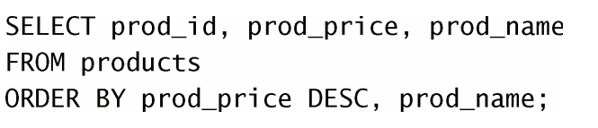

*只对
prod_price列指定DESC，对prod_name列不指定。因此，
prod_price列以降序排序，而prod_name列（在每个价格内）仍然按标准
的升序排序*

# 过滤数据
**WHERE子句**

`在同时使用ORDER BY和WHERE子句时，应
该让ORDER BY位于WHERE之后`

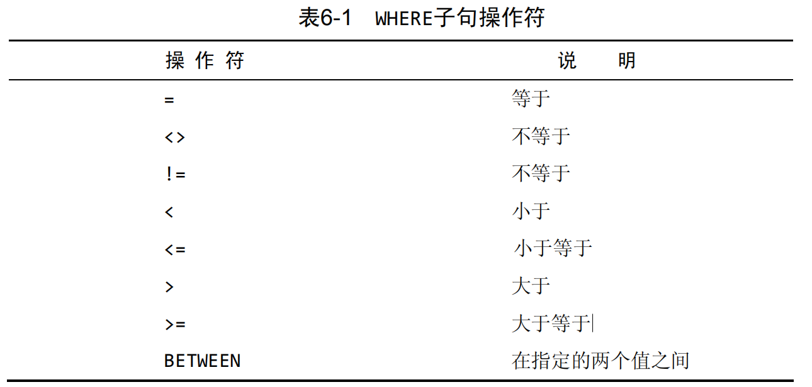

## 空值检查
**IS NULL子句**

# 数据过滤
> * MySQL允许给出多个WHERE子句。这些子
句可以两种方式使用：以AND子句的方式或OR子句的方式使用
> * 操作符（operator） 用来联结或改变WHERE子句中的子句的关键
字。也称为逻辑操作符（logical operator）

>为了通过不止一个列进行过滤，可使用AND操作符给WHERE子句附加
条件
## AND操作符
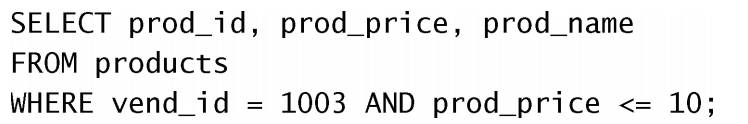
## OR操作符
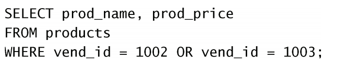
## 计算次序
> SQL（像多数语言一样）在处理OR操作符前，优先处理AND操
作符

**wrong example**
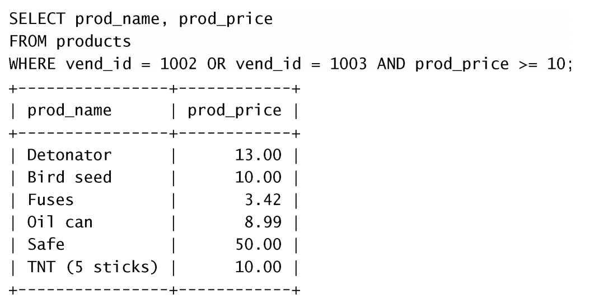
**correct example**

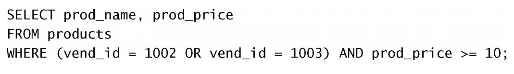

## IN操作符
> IN操作符用来指定条件范
围，范围中的每个条件都可以进行匹配

## NOT操作符
>WHERE子句中的NOT操作符有且只有一个功能，那就是否定它之后所
跟的任何条件

# 用通配符进行过滤
## LIKE操作符
`为在搜索子句中使用通配符，必须使用LIKE操作符`
## 百分号（%）通配符

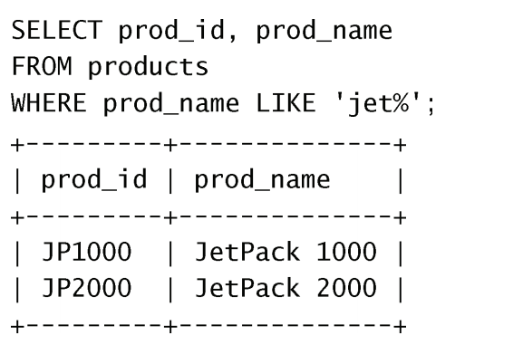

## 下划线（_）通配符
> 下划线的用途与%一样，但下划
线只匹配单个字符而不是多个字符。

# 用正则表达式进行搜索
## 进行OR匹配
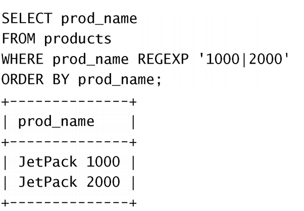

# 创建计算字段
## 拼接字段
**Concat()函数**

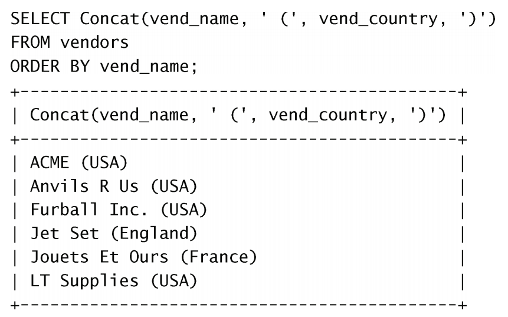

**LTrim()/RTrim()/Trim()函数**
>删除数据左测/右侧/多余的空格

## 使用别名
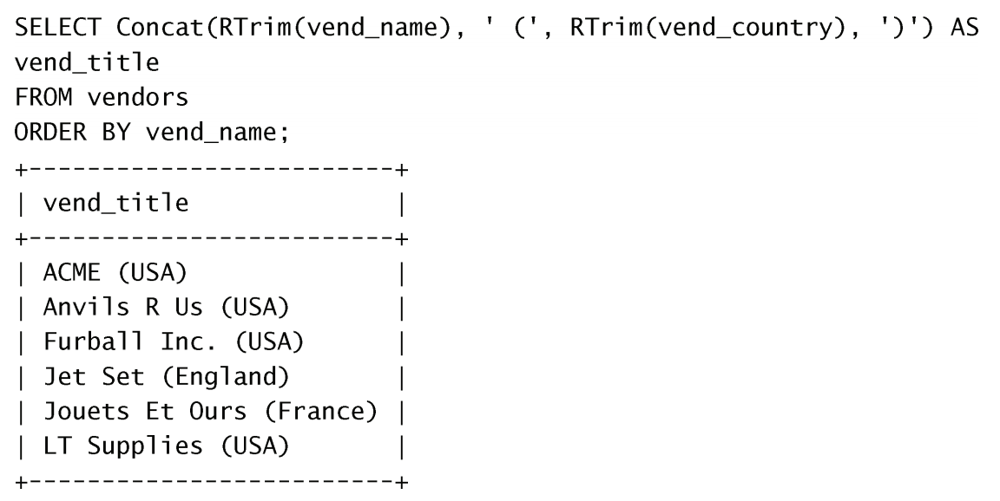

## 执行算术计算
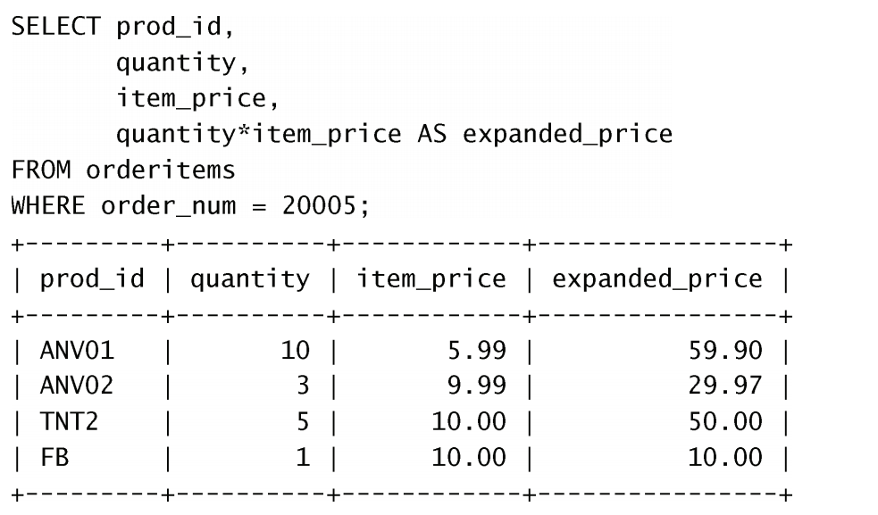

# 数据处理函数
>聚集函数（aggregate function） 运行在行组上，计算和返回单个值的函数

# 汇总数据
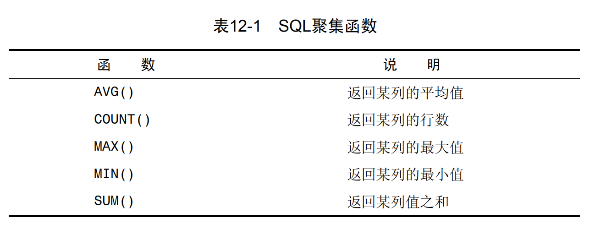

# 分组数据
## 创建分组
**GROUP BY子句**

`GROUP BY子句必须出现在WHERE子句之后，ORDER BY子句之前`
`WHERE过滤行，而HAVING过滤分组 `
> HAVING和WHERE的差别 这里有另一种理解方法，WHERE在数据
分组前进行过滤，HAVING在数据分组后进行过滤。这是一个重
要的区别，WHERE排除的行不包括在分组中。这可能会改变计
算值，从而影响HAVING子句中基于这些值过滤掉的分组。

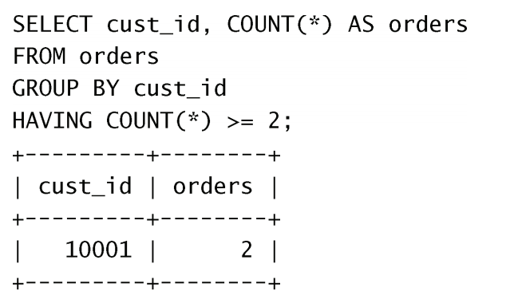
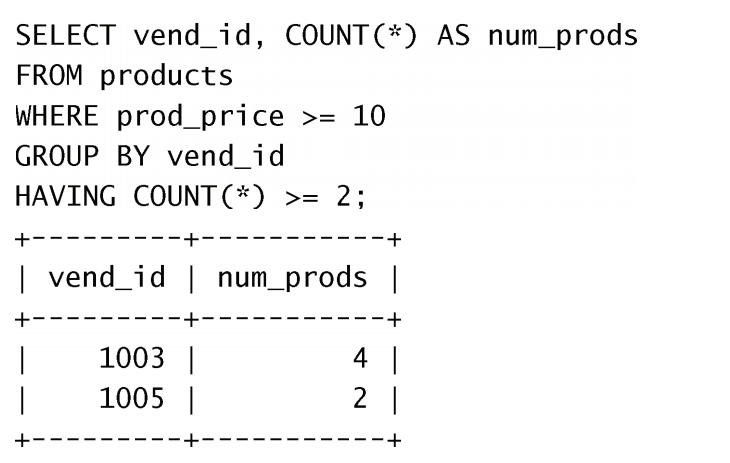

## SELECT子句顺序
子句 | 说明 | 是否必须使用
- | - | - |
SELECT | 要返回的列或表达式 | 是
FROM | 从中检索数据的表 | 仅在从表选择数据时使用
WHERE | 行级过滤 | 否
GROUP BY | 分组说明 | 仅在按组计算聚集时使用
HAVING | 组级过滤 | 否
ORDER BY | 输出排序顺序 | 否
LIMIT | 要检索的行数 | 否

# 子查询

# 联 结 表
>外键（foreign key） 外键为某个表中的一列，它包含另一个表的主键值，定义了两个表之间的关系。

## 内部联结